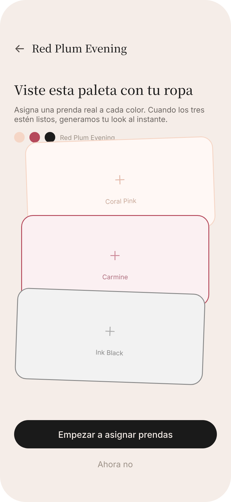
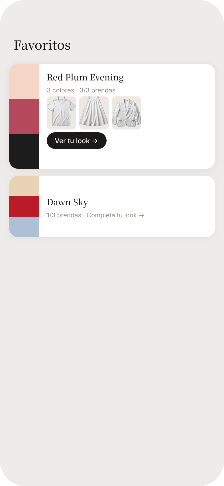
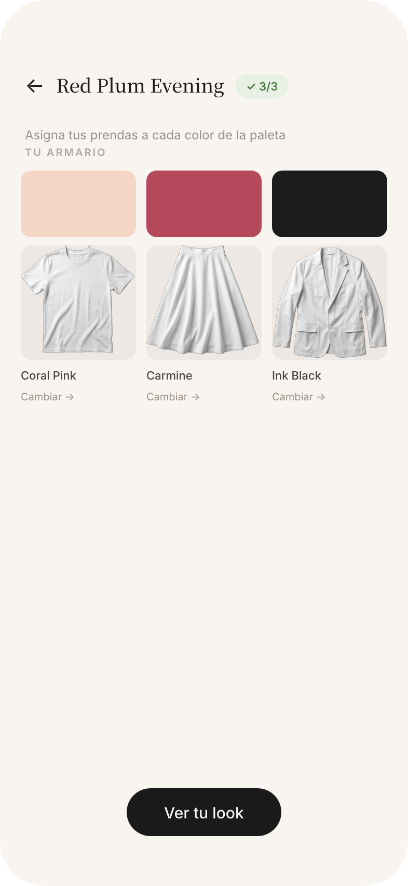
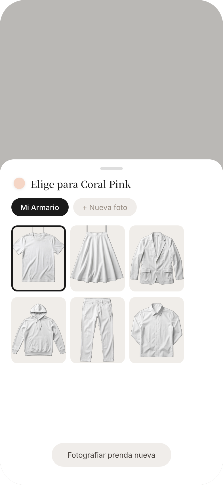
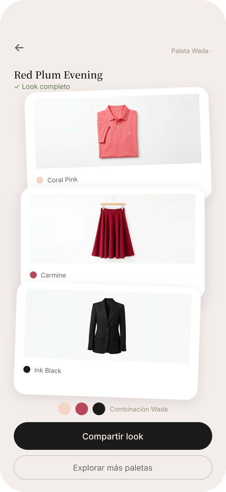
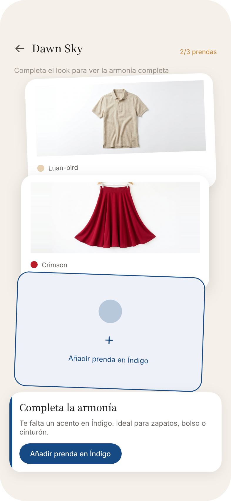

# Armario Virtual — Feature Spec & Design Document

**Estado:** Exploración UX completada · Pendiente de spec técnico formal  
**Fecha:** 2026-04-16  
**Autor:** Alejandro Camps (producto) + Sally UX  
**Contexto:** Post v1.3.0 · Candidato a Epic 13

---

## 1. Qué es esta feature

**Armario Virtual** transforma los Favoritos de Outfinder de una colección de paletas de color abstractas en outfits personales reales.

El usuario asigna fotografías de sus prendas reales a cada color de una combinación Wada que tiene guardada en Favoritos. Cuando tiene las tres prendas asignadas, la app auto-compila un "look" visual: las tres fotos de sus prendas aparecen en una composición estilo polaroid que puede compartir o usar como referencia al vestirse.

### El problema que resuelve

Outfinder muestra que el Coral Pink + Carmine + Ink Black funcionan juntos según Sanzo Wada. Pero el usuario tiene que hacer el salto mental él solo: "¿qué tengo yo en el armario que sea de esos colores?" Esta feature hace ese puente. El usuario deja de ver paletas de color y empieza a ver sus outfits.

### Por qué encaja con la filosofía Wada

La app nunca le dice al usuario qué tipo de prenda ponerse. Le dice qué colores funcionan juntos. El usuario decide si el Coral Pink es su polo, su bolso o sus deportivas. Esta feature respeta esa filosofía: **recomendamos colores, el usuario elige las prendas**.

---

## 2. Flujo completo de pantallas

```
S1 Favoritos
    │
    ├─► [combo sin prendas] ──► S0 Zero State ──► S2 Ficha Wada
    │
    └─► [combo con prendas] ──► S2 Ficha Wada
                                      │
                                      ├─► [toca "Asignar →"] ──► S3 Armario Picker
                                      │                               │
                                      │                         [selecciona prenda]
                                      │                               │
                                      │                          vuelve a S2
                                      │
                                      ├─► [combo incompleto] ──► S5 Sugerencia Armonía
                                      │
                                      └─► [combo completo] ──► S4 Tu Look
                                                                    │
                                                              "Compartir look"
```

---

## 3. Pantallas — descripción visual y funcional

### S0 — Zero State (Primera vez)



**¿Cuándo aparece?**  
Cuando el usuario toca un Favorito que no tiene ninguna prenda asignada todavía.

**¿Qué muestra?**  
- Nav: nombre de la combinación Wada (`← Red Plum Evening`)
- Título grande en serif: *"Viste esta paleta con tu ropa"*
- Subtítulo explicativo: *"Asigna una prenda real a cada color. Cuando los tres estén listos, generamos tu look al instante."*
- Fila de dots Wada con el nombre de la paleta
- **3 tarjetas polaroid vacías** en cascada vertical, cada una teñida sutilmente con su color Wada y con un `+` central. Esto pre-visualiza exactamente el resultado final (S4) — el usuario entiende qué está construyendo sin que se lo expliquen.
- CTA primario: **"Empezar a asignar prendas"**
- Escape: *"Ahora no"* (vuelve a S1 sin crear nada)

**Decisión de diseño clave:**  
Las tarjetas vacías tienen exactamente la misma forma y posición que tendrán en S4 cuando estén llenas. Es un "empty state que ya es el resultado" — el usuario ve el molde de lo que va a construir.

---

### S1 — Favoritos (enriquecidos)



**¿Qué cambia respecto al S1 actual?**  
Las tarjetas de combinaciones en Favoritos incorporan:

- **Badge de estado** (top right): `3/3 prendas` (verde), `1/3 prendas` (ámbar), `Sin prendas` (gris)
- **Thumbnails de prendas asignadas** (si existen): miniaturas de las fotos del usuario
- **CTA contextual**: *"Ver tu look →"* cuando está completo, *"Completa tu look →"* cuando está parcial
- **Orden**: las combinaciones completas suben al principio de la lista (las más accionables primero)

---

### S2 — Ficha Wada (asignación)



**¿Qué muestra?**  
- Nav: `← [Nombre combo]` + badge `✓ 3/3` o `1/3`
- Instrucción: *"Asigna tus prendas a cada color de la paleta"*
- **3 columnas**, una por color Wada:
  - Swatch del color (rectángulo redondeado)
  - Foto de la prenda asignada (o slot vacío punteado si no hay)
  - Nombre del color Wada
  - Link: *"Cambiar →"* (si asignada) o *"Asignar →"* (si vacía)
- CTA primario en footer: **"Ver tu look"**
  - Si combo completo → navega a S4
  - Si combo incompleto → navega a S5

**Notas de implementación:**  
- Tocar "Asignar →" o "Cambiar →" abre S3 como bottom sheet modal sobre S2
- Al confirmar la selección en S3, S2 se actualiza con la nueva foto sin navegar

---

### S3 — Armario Picker (selector de prenda)



**¿Qué es?**  
Bottom sheet modal que aparece sobre S2. No es una pantalla completa, deja ver S2 por encima del scrim oscuro.

**¿Qué muestra?**  
- Header: *"Elige para [Color Name]"* + dot del color Wada
- Tabs: **"Mi Armario"** / **"+ Nueva foto"**
- **Tab "Mi Armario"**: grid 3 columnas con todas las prendas que el usuario ha fotografiado previamente. Las prendas tienen fondo transparente (ya recortadas). La seleccionada muestra un anillo de selección.
- **Tab "+ Nueva foto"**: abre directamente la cámara o el selector de fotos del sistema
- CTA secondary en footer: *"Fotografiar prenda nueva"* (alias para el tab Nueva foto)

**Comportamiento de selección:**  
Al tocar una prenda del armario → queda seleccionada con anillo visual → al cerrar el sheet (swipe down o tap fuera) la selección se confirma y actualiza S2.

**Importante:**  
Una misma prenda puede asignarse a múltiples combinaciones. El armario es un repositorio compartido de prendas, no está ligado a una combinación específica.

---

### S4 — Tu Look (resultado completo)



**¿Cuándo aparece?**  
Solo cuando la combinación tiene las 3 prendas asignadas (combo completo).

**¿Qué muestra?**  
- Nav: `← Paleta Wada ·`
- Título: nombre de la combinación Wada (Noto Serif JP, prominente)
- Badge: `✓ Look completo` en verde
- **3 tarjetas polaroid en cascada vertical**, ligeramente rotadas (+2°, 0°, -2°), overlapping ~32px:
  - Cada tarjeta: fondo blanco, foto de la prenda con fondo recortado, label del color Wada abajo
- Fila de dots Wada + *"Combinación Wada"* label
- CTA primario: **"Compartir look"** — captura el área de tarjetas como imagen y abre el share sheet
- CTA secundario: **"Explorar más paletas"** — vuelve a la pantalla de combinaciones

**Decisión de diseño clave — portrait first:**  
La primera versión tenía un abanico horizontal (fan) de las 3 prendas. Se descartó porque en portrait desperdicia espacio vertical y las prendas quedaban pequeñas. Las tarjetas en cascada vertical usan toda la altura de la pantalla, cada prenda es claramente visible, y la composición se lee como un outfit de arriba a abajo de forma natural.

---

### S5 — Sugerencia de Armonía (resultado incompleto)



**¿Cuándo aparece?**  
Cuando el usuario toca "Ver tu look" en S2 pero la combinación está incompleta (1/3 o 2/3).

**¿Qué muestra?**  
- Nav: `← [Nombre combo]` + badge `2/3 prendas` en ámbar
- Subtítulo: *"Completa el look para ver la armonía completa"*
- **Tarjetas polaroid en cascada vertical**:
  - Las prendas asignadas: tarjeta blanca normal con foto
  - El slot vacío: tarjeta con fondo azul claro (#EEF2F8), borde del color Wada ausente, `+` central, *"Añadir prenda en [Color]"*
- **Card de sugerencia** en la parte inferior: acento lateral del color ausente, título *"Completa la armonía"*, texto de contexto (*"Te falta un acento en Índigo. Ideal para zapatos, bolso o cinturón."*), CTA *"Añadir prenda en Índigo"*

**Decisión de diseño clave:**  
El hueco visual de la tercera tarjeta crea tensión narrativa — el usuario literalmente ve el espacio vacío en su outfit. No hace falta explicar que falta algo: se ve. La card de sugerencia debajo contextualiza por qué ese color completa la armonía.

**El texto de sugerencia viene del dataset Wada:**  
"Ideal para zapatos, bolso o cinturón" no es copy fijo — en producción vendría de la lógica de la posición del color en la combinación (tercer color = acento = tipicamente accesorio). Ver sección 6 para detalle.

---

## 4. Flujo de captura de prenda nueva

Este sub-flujo se activa desde S3 (tab "+ Nueva foto" o CTA "Fotografiar prenda nueva") y no tiene pantalla propia en el prototipo actual, pero necesita diseño antes de implementar.

```
[S3 Armario Picker]
    │
    └─► Abrir cámara / selector de fotos
            │
            ├─► [Cámara] ──► Guidance UI: "Pon la prenda sobre fondo liso, buena luz"
            │                     │
            │               Captura foto
            │
            └─► [Fotos] ──► Selección de foto existente
                                  │
                    ┌─────────────┘
                    │
            Procesamiento background removal
            (VNGenerateForegroundInstanceMaskRequest)
                    │
            Preview resultado:
            - Prenda recortada sobre fondo neutro
            - Botón "Repetir" si el recorte es malo
            - Botón "Usar esta foto"
                    │
            [Confirmar] ──► Prenda guardada en Mi Armario
                         ──► Vuelve a S3 con la prenda nueva seleccionada
```

### Consideraciones UX del flujo de captura

- **La instrucción de captura es más importante que el algoritmo.** Si el usuario fotografía la prenda sobre fondo blanco con buena luz, `VNGenerateForegroundInstanceMaskRequest` funciona excelentemente. La UX de guidance es el 80% de la calidad del resultado.
- **El preview post-recorte es obligatorio.** El usuario tiene que ver el resultado antes de guardar. Si el recorte es malo (prenda con sombras complejas, patrón muy detallado) tiene que poder repetir sin frustración.
- **No hay retoque manual en MVP.** No hay herramienta de brush para arreglar el recorte. Si el algoritmo falla, el usuario repite con mejor foto.

---

## 5. Modelo de datos propuesto

### Entidades

```typescript
// Prenda fotografiada por el usuario (repositorio compartido)
interface WardrobeItem {
  id: string;                    // UUID generado al crear
  localImagePath: string;        // Ruta en expo-file-system tras recorte
  thumbnailPath: string;         // Versión reducida para grids
  createdAt: number;             // timestamp
}

// Asignación de prenda a un slot de color dentro de una combinación
interface CombinationAssignment {
  combinationId: number;         // ID del combinations.json
  colorIndex: number;            // 0, 1, 2 — posición del color en la combo
  wardrobeItemId: string;        // FK a WardrobeItem.id
  assignedAt: number;            // timestamp
}
```

### Almacenamiento

- **WardrobeItems[]**: `AsyncStorage` key `@wardrobe_items` — array serializado
- **CombinationAssignments[]**: `AsyncStorage` key `@combination_assignments` — array serializado
- **Imágenes recortadas**: `expo-file-system` en `FileSystem.documentDirectory + 'wardrobe/'`

### Consultas frecuentes que el código necesitará

```typescript
// ¿Cuántas prendas tiene asignadas esta combinación?
getAssignmentCount(combinationId: number): number

// ¿Está completa esta combinación?
isCombinationComplete(combinationId: number, totalColors: number): boolean

// ¿Qué prendas tiene asignadas esta combinación?
getAssignmentsForCombination(combinationId: number): CombinationAssignment[]

// Todas las prendas del armario del usuario
getAllWardrobeItems(): WardrobeItem[]

// ¿Tiene alguna combinación en Favoritos al menos 1 prenda asignada?
hasAnyEnrichedFavorite(): boolean
```

---

## 6. Consideraciones técnicas clave

### 6.1 Background removal — el reto principal

**API recomendada:** `VNGenerateForegroundInstanceMaskRequest` (Vision framework, iOS 17+)

- Disponible desde iOS 17. Outfinder ya tiene iOS 17+ como target mínimo efectivo desde Epic 12 (SwiftWhiteBalance).
- Da resultados excelentes con ropa plana sobre fondo homogéneo. La calidad degrada con fondos complejos o prendas con patrones de alta frecuencia (cuadros pequeños, estampados muy detallados).
- La infraestructura de módulo nativo local ya existe desde Epic 12 (`WhiteBalanceModule`). Añadir background removal es un módulo nuevo pero el patrón está validado.

**Alternativa para iOS < 17:** `VNGenerateForegroundMaskRequest` (iOS 15+) — menos precisa pero más amplia cobertura.

**Output:** PNG con canal alpha (fondo transparente). Se guarda en `FileSystem.documentDirectory`.

**Lo que NO es viable:**
- Recorte manual en JS (demasiado lento, mala calidad)
- API de terceros (conectividad requerida, coste, privacidad — las fotos de ropa del usuario son datos sensibles)
- Core ML model genérico (tamaño de bundle, mantenimiento)

### 6.2 Composición del look en S4

S4 no requiere ningún procesamiento de imagen en tiempo real. Es una **composición estática de React Native Views**:

- 3 `View` con `style={{ backgroundColor: 'white', borderRadius: 20 }}`
- Cada `View` contiene un `Image` con la ruta local de la prenda recortada
- `Image` con `resizeMode="contain"` para que la prenda no se recorte
- Las rotaciones son `transform: [{ rotate: '2deg' }]`
- Los overlaps son `marginTop: -32` en las tarjetas 2 y 3
- **No se necesita Skia Canvas** para S4 — es CSS layout puro

Para el **share de S4** sí se necesita captura del nodo como imagen:
- `react-native-view-shot` o `expo-image-manipulator` para capturar el área de tarjetas
- `Share.share()` con el archivo generado

### 6.3 Integración con el sistema de Favoritos existente

El sistema de Favoritos actual guarda `combinationIds[]` en AsyncStorage. No hay que cambiar esa estructura. El Armario Virtual añade **dos stores paralelos** (`wardrobe_items` y `combination_assignments`) que se consultan cuando se renderiza la pantalla de Favoritos.

**Regla de compatibilidad:** si no existe ningún `CombinationAssignment` para un `combinationId`, la combo se muestra exactamente igual que ahora. El enriquecimiento es 100% aditivo, no rompe el estado actual de ningún usuario.

### 6.4 Lógica de sugerencia en S5

El texto de sugerencia *"Ideal para zapatos, bolso o cinturón"* no es copy hardcodeado. La lógica debería ser:

```typescript
function getSuggestionCopy(colorIndex: number, totalColors: number): string {
  // El último color de una combo Wada tiende a ser el acento/detalle
  // Los primeros colores tienden a ser las piezas principales
  if (colorIndex === totalColors - 1) {
    return 'Ideal para un accesorio: zapatos, bolso o cinturón.'
  } else if (colorIndex === 0) {
    return 'Suele ser la pieza principal del look.'
  } else {
    return 'Puede ser una segunda capa o prenda de punto.'
  }
}
```

Esto es una heurística, no una regla Wada oficial. Se puede iterar con datos reales de uso.

---

## 7. Lo que esta feature NO hace (scope MVP)

Para evitar scope creep, estas cosas quedan explícitamente fuera:

| ❌ No incluido | Razón |
|---|---|
| Editor de recorte manual (brush) | Complejidad alta, bajo ROI en MVP |
| Organización del armario por tipo de prenda | Color es el principio organizador, no la categoría |
| Compartir el armario entre usuarios | No hay backend, app offline-first |
| Sincronización iCloud | Complejidad, fuera de scope MVP |
| Mannequí 3D con física de ropa | Requiere Clo3D-level ML, no viable |
| Composición 3D foto-a-mesh | Requiere segmentación 3D, años de R&D |
| Recomendación de qué comprar | Rompe propuesta de valor (no somos e-commerce) |
| Importar desde redes sociales | Privacidad, complejidad de integración |

---

## 8. Dependencias técnicas nuevas

| Dependencia | Uso | ¿Ya existe? |
|---|---|---|
| `VNGenerateForegroundInstanceMaskRequest` | Background removal nativo | No — módulo nativo nuevo |
| `expo-file-system` | Almacenar imágenes recortadas | Probablemente ya en el proyecto |
| `react-native-view-shot` | Capturar S4 para compartir | No — dependencia nueva |
| `AsyncStorage` | Almacenar WardrobeItems + Assignments | Ya existe |
| Local Expo module (Swift) | Exponer VNGenerateForeground a JS | Patrón ya validado en Epic 12 |

---

## 9. Preguntas abiertas para los devs

Estas cuestiones necesitan decisión técnica antes de especificar las stories:

1. **¿`expo-file-system` ya está en el proyecto?** Si no, ¿alguna razón para no añadirlo?

2. **¿`VNGenerateForegroundInstanceMaskRequest` o `VNGenerateForegroundMaskRequest`?** El primero es iOS 17+ y más preciso. El segundo cubre iOS 15+. ¿Qué porcentaje de nuestros usuarios tiene iOS 16 o menos? (ver Analytics)

3. **Tamaño de las imágenes guardadas.** Un usuario con 20 prendas × ~500KB por PNG recortado = ~10MB. ¿Aceptable? ¿Hay que comprimir o limitar?

4. **Preview de recorte antes de guardar.** ¿Lo implementamos como un `Modal` sobre S3 o como pantalla propia? Afecta a la navegación.

5. **¿Re-usar prendas entre combinaciones?** El modelo propuesto permite que la misma prenda aparezca en múltiples combinaciones (el polo azul marino puede ser el "Ink Black" de una combo y el "Deep Navy" de otra). ¿Esto es correcto UX? Confirmarlo antes de modelar.

6. **¿Qué pasa si el usuario elimina un Favorito que tiene prendas asignadas?** ¿Eliminamos las asignaciones también? ¿Las prendas del armario quedan huérfanas?

7. **`react-native-view-shot` o alternativa nativa para el share?** Confirmar compatibilidad con Expo SDK 55 antes de añadir.

---

## 10. Criterios de éxito de la feature

- El usuario puede asignar una prenda a un color de su combinación Wada favorita en menos de 3 taps desde S1
- La foto de la prenda queda correctamente recortada (fondo eliminado) en >85% de los casos cuando la foto se tomó con fondo liso
- El look en S4 es visualmente coherente y el usuario reconoce sus prendas
- "Compartir look" genera una imagen limpia compartible (sin chrome de la app)
- Las combinaciones completas aparecen primero en S1
- El estado del armario persiste entre sesiones (AsyncStorage)

---

## 11. Archivos de referencia

| Archivo | Contenido |
|---|---|
| `docs/img_screenshot/armario_virtual/armario.pen` | Prototipo Pencil completo (todas las pantallas) |
| `docs/planning/real_clothes/` | Fotos reales de prendas usadas en el prototipo |
| `docs/planning/garments-catalog-wishlist.md` | Catálogo de siluetas PNG disponibles y wishlist |
| `docs/planning/feature-armario-virtual/screens/` | Exports PNG de cada pantalla (este mismo directorio) |
| `src/data/combinations.json` | Dataset Wada — combinaciones de colores |
| `src/data/colors.json` | Dataset Wada — colores con hex, nombres EN/ES |
| `_bmad/` | Config BMad para generación de epics/stories |
