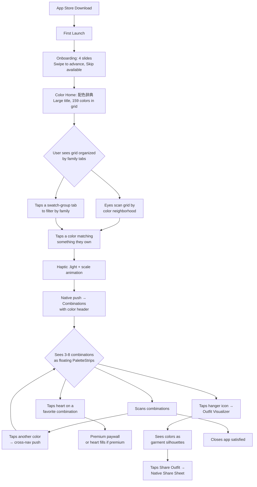
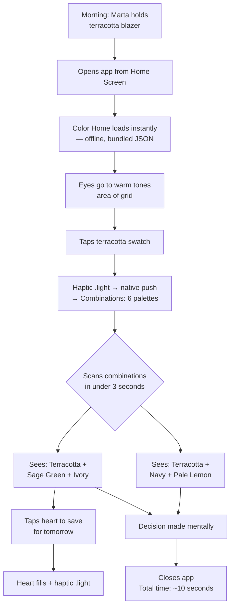
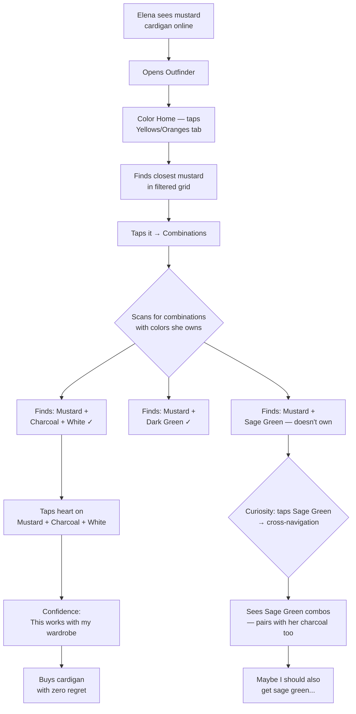
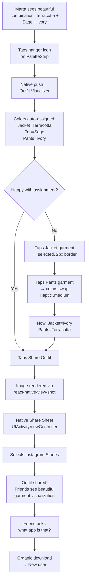
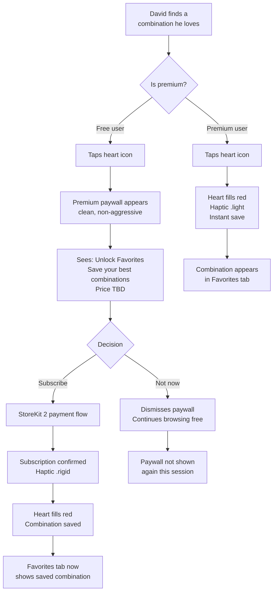

# UX Design Specification Outfinder (React Native iOS)

**Author:** Alejandro
**Date:** 2026-03-12

---

<!-- UX design content will be appended sequentially through collaborative workflow steps -->

## Executive Summary

### Project Vision

Outfinder is a React Native iOS app that evolves Project1's validated PWA prototype into a native, monetizable App Store product. The core remains Sanzo Wada's 348 curated color combinations as an instant outfit coordination tool — but the positioning shifts from "color reference tool" to "visual outfit coordinator." The key differentiator is the Outfit Visualizer: abstract color palettes become customizable garment silhouettes that users can share on Instagram and TikTok. The product targets style-conscious professionals aged 25-35+ who face daily decision paralysis combining garment colors. The core interaction completes in under 30 seconds: select color → browse combinations → visualize as outfit → decide or share. No wardrobe cataloging, no photo uploads, no AI — just proven color harmony made visual and shareable. Monetization follows a freemium model with iOS In-App Purchase.

The native iOS version must achieve two seemingly contradictory goals: feel like a first-class Apple citizen (native navigation, haptics, gestures, Dynamic Type) while preserving the distinctive Wada book aesthetic (warm paper, hairline dividers, Japanese typography, floating color strips) that IS the product's identity. The resolution is: native infrastructure, Wada surface. iOS provides the skeleton (UITabBarController, UINavigationController, Share Sheet, StoreKit); Wada's book provides the skin.

### Target Users

**Primary: Marta "The Optimizer" (28)**
Marketing manager with a curated wardrobe of ~50 pieces. Already dresses well but repeats the same 5-6 combinations. Discovers Outfinder through a viral TikTok showing Wada palette outfits. Uses the app in her morning routine and while shopping. Tech-comfortable — expects native iOS polish. The Outfit Visualizer is her share-to-Instagram moment.

**Primary: David "The Starter" (31)**
Software engineer transitioning to intentional dressing. Lacks color knowledge and defaults to safe choices (all-black, navy+white). Uses the app before shopping trips and gradually incorporates it into morning routines. Needs confidence-building — the app should feel authoritative, not overwhelming. The combination count ("appears in 14 palettes") is his permission signal.

**Primary: Elena "The Validator" (26)**
UX designer who shops online frequently. Struggles with the gap between "this piece looks great alone" and "will it work with what I already own?" Uses the app to validate purchases before buying. Cross-navigation is her power feature — she chains colors to check compatibility against her wardrobe staples. Reduces her 30% return rate.

**Secondary: Content Creators & Stylists**
Fashion micro-influencers who create "what to wear" content on TikTok/Instagram. The Outfit Visualizer gives them ready-made visual content — shareable outfit silhouettes with Wada's cultural backstory as a content hook. The 2-tap share flow is designed for them. They are amplifiers, not the core paying audience.

### Key Design Challenges

1. **Native identity without losing Wada identity:** iOS Human Interface Guidelines favor system components, SF Symbols, and standard navigation patterns. Wada's aesthetic is bespoke — warm paper backgrounds, Japanese serif typography, cardless floating color strips. The challenge is using native infrastructure (tab bar, navigation stack, haptics) while keeping every pixel of content faithful to the book aesthetic.

2. **Favorites without friction:** Adding save/unsave to the browsing flow must feel effortless — one gesture, zero interruption. The interaction must be discoverable (David needs to find it) but non-intrusive (Marta shouldn't feel pressured to save everything). iOS conventions (heart icon, swipe gestures) provide familiar patterns.

3. **Premium paywall that feels like a natural upgrade:** The Outfit Visualizer is free (it's the viral hook). Favorites and outfit saving are premium. The transition from "this is great for free" to "I'd pay for this" must feel earned, not gated. The paywall must comply with App Store guidelines (no misleading free-tier promises).

4. **Share flow as growth engine:** The outfit visualization must produce images that look native on Instagram Stories (9:16, 1080×1920px) and TikTok. 2 taps maximum from Outfit Visualizer to Share Sheet. The shared image must be beautiful enough to generate organic downloads — it's the primary acquisition channel.

### Design Opportunities

1. **iOS-native polish as quality signal:** Real UIImpactFeedbackGenerator haptics (not web vibration), spring animations, SF Symbols for navigation icons, Dynamic Type support, native dark mode adaptation — every native detail communicates premium quality that justifies the subscription price.

2. **Tab bar navigation unlocking Favorites as a destination:** Moving from the PWA's 2-item custom bottom bar to a native UITabBarController with 3 tabs (Colors / Favorites / Settings) makes Favorites a first-class citizen, increasing premium conversion.

3. **Native Share Sheet for viral reach:** UIActivityViewController provides access to every installed app — Instagram, TikTok, WhatsApp, Messages, AirDrop — with zero custom integration per platform. The outfit visualization image does the selling; the Share Sheet does the distribution.

## Core User Experience

### Defining Experience

**"Tap a color, see what Wada says it pairs with — then see it as an outfit."**

The core interaction chain extends from the PWA's 3-step model to a 4-step native flow: **find your color → see combinations → visualize as outfit → decide or share.** The Outfit Visualizer transforms the emotional peak — seeing harmonious combinations — into something tangible: garment silhouettes the user can customize and share. This is what makes Outfinder a fashion tool rather than a color reference.

The dataset remains the same: 159 colors organized into 348 palettes (predominantly 3-color combinations). Colors range from appearing in 1 combination (specialty accents) to 23 combinations (Black). The median is 6 combinations per color — a meaningful but scannable result set.

**Two entry paths (preserved from PWA):**

1. **Visual scan:** User's eye finds their color in the grid by hue family grouping — terracotta is near other warm earth tones
2. **Family-first navigation:** User taps a swatch-group tab (e.g., "Warm Earth") to filter the grid from 159 to ~25-30 colors

Both paths converge at the Combinations screen. From there, the native app adds two new exit paths the PWA didn't have:
- **Outfit Visualizer:** Tap the hanger icon on any PaletteStrip → see colors as garment silhouettes → customize → share
- **Favorite:** Tap the heart on any PaletteStrip → saved to Favorites tab for future reference

### Platform Strategy

- **React Native iOS:** Native app targeting iPhone, App Store distribution. React Native with NativeWind for styling
- **Bundled dataset:** JSON (~60KB) shipped in app binary. Full offline functionality from first launch — no network dependency for core features
- **Touch-optimized:** All interactions designed for thumb-reach. Native iOS haptics (UIImpactFeedbackGenerator) for tactile confirmation
- **Native navigation:** UINavigationController for push/pop stacks. UITabBarController for top-level destinations. Native swipe-back gesture
- **Offline-first:** No service worker needed — the dataset IS the app. Network only needed for: IAP validation, future cloud sync
- **App Store native:** StoreKit 2 for In-App Purchase. Native Share Sheet. Native camera (future outfit photo capture)

| PWA Pattern | iOS Native Replacement |
|-------------|----------------------|
| Custom BottomBar (2 tabs) | UITabBarController (3 tabs: Colors / Favorites / Profile) |
| Browser history stack | UINavigationController with native swipe-back |
| Web Vibration API | UIImpactFeedbackGenerator (.light, .medium, .rigid) |
| Web Share API | UIActivityViewController (native Share Sheet) |
| localStorage | AsyncStorage + UserDefaults |
| vite-plugin-pwa / Service Worker | Bundled JSON in app binary (offline by default) |
| Shadcn Tabs | React Native sectioned tabs (custom, NativeWind styled) |
| Shadcn Sheet | React Native bottom sheet (@gorhom/bottom-sheet) |
| Shadcn Dialog | React Native Modal or custom dialog |
| Google Fonts (Noto Serif JP) | Bundled font in app binary |
| CSS transitions | React Native Reanimated (spring-based) |

### Effortless Interactions

1. **Swatch-group navigation:** The 6 color families provide instant filtering. Tab switching is immediate — no network, no animation delay. Native horizontal scroll with momentum
2. **Selected color highlight:** The user's color is visually anchored within each PaletteStrip via a white 6px dot — persistent context across all combinations
3. **Japanese names as primary identity:** 薄紅 with "Hermosa Pink" beneath. Noto Serif JP bundled in the app binary for guaranteed rendering — no font-loading flash
4. **Favorite toggle:** Heart icon on each PaletteStrip. One tap to save, one tap to unsave. Haptic .light + scale animation on the heart. No confirmation dialog. Appears in Favorites tab instantly
5. **Cross-navigation as exploration:** Tap any color within a combination → push to that color's combinations. Native swipe-back to return. The stack builds naturally — users explore Wada's color graph intuitively
6. **Outfit Visualizer entry:** Hanger icon on each PaletteStrip → push to visualizer. Colors auto-assigned to garments. Tap-swap to reassign. 2 taps to share
7. **Versatility signal:** "Appears in 14 combinations" displayed on the Combinations header — signals wardrobe versatility without explanation

### Critical Success Moments

1. **The Discovery Moment (Marta):** Seeing a palette and realizing "I own those colors but never combined them." Amplified by the Outfit Visualizer turning abstract colors into recognizable garments
2. **The Confidence Moment (David):** Seeing his navy in 14 Wada combinations, including one with dusty rose. The count provides authority. Saving it to Favorites builds his "wardrobe playbook"
3. **The Validation Moment (Elena):** Checking a potential purchase color against her wardrobe staples via cross-navigation. Finding 3+ combinations with colors she owns → buys with zero regret
4. **The Share Moment (Viral):** An outfit visualization so visually striking the user shares it to Instagram Story. Friends ask "what app is that?" — organic acquisition
5. **The Natural Upgrade (Premium):** After 5-10 uses, user taps Favorite on a combination → paywall. The value is already proven — the upgrade feels like unlocking something they already use, not paying for something new

### Experience Principles

1. **Color-first, chrome-last:** Wada's colors dominate every screen. iOS UI is invisible infrastructure — tab bar, nav bar, and share sheet are scaffolding, not identity. Every pixel of non-color UI must justify its existence
2. **Native where you feel, Wada where you see:** Transitions, haptics, and gestures are 100% iOS native (spring animations, UIImpactFeedbackGenerator, swipe-back). Content surfaces (color grid, palette strips, mannequin) are 100% Wada aesthetic (warm paper, hairline dividers, Japanese serif)
3. **30 seconds or less:** The full loop — open → color → combinations → outfit → decide/share — completes in under 30 seconds. Every additional tap is a design failure
4. **Favorites as wardrobe playbook:** Saved combinations aren't bookmarks — they're the user's curated wardrobe system. Accumulated value creates the natural premium upgrade path
5. **Share-worthy by default:** Every Outfit Visualizer screen produces an image the user WANTS to share without being prompted. The content sells the app; the Share Sheet distributes it
6. **Japanese authenticity as design language:** The kanji/hiragana labels set the emotional tone of the entire product — cultured, authoritative, distinctive. No competitor can replicate this cultural connection to Wada's original work

## Desired Emotional Response

### Primary Emotional Goals

1. **Quiet Confidence:** The user feels like they know what they're doing — not because the app taught them color theory, but because every result feels undeniably right. "I'm not guessing, I'm choosing."
2. **Rediscovery:** The joy of finding value in what you already own. "I had this shirt for two years and never knew it worked with this." This emotion drives retention — every session can unlock something new from the same wardrobe.
3. **Elevated Simplicity:** The app feels serene and sophisticated — like opening a well-designed book, not a tech product. The Japanese names, minimal chrome, and Wada's curated authority create an experience that feels cultured without being pretentious.
4. **Ownership & Curation (new for native):** "These are MY combinations." Favorites transforms discovery into possession. The user builds a personal playbook — and that emotional attachment to curated content creates the natural premium upgrade path. This emotion didn't exist in the PWA because there was no persistence mechanism.

### Emotional Journey Mapping

| Stage | Emotion | Trigger | Delta vs. PWA |
|-------|---------|---------|---------------|
| **App Store discovery** | Intrigue + aspiration | Screenshots showing outfit visualizations with Japanese aesthetic | New — no PWA equivalent |
| **First open** | Intrigue + calm | Minimal UI, Japanese names, beautiful color grid — "this feels different" | Same, enhanced with native Spring animations |
| **First color tap** | Anticipation | UIImpactFeedbackGenerator.light — richer tactile feedback than web vibration | Sensory upgrade |
| **Seeing combinations** | Surprise + recognition | "I have those colors!" — the discovery moment | Same |
| **First Outfit Visualizer** | Delight + "aha" | Abstract colors become clothing silhouettes. "This is what I'd wear" | Amplified — the visualizer is the emotional peak |
| **First share** | Pride + social validation | Sharing a beautiful outfit to Instagram Story → reactions from friends | New — web share was limited |
| **First favorite** | Ownership + intent | "I'm keeping this one" → haptic + heart animation | New — no persistence in PWA |
| **Returning next day** | Familiarity + curiosity | "What else can I discover today?" — the wardrobe feels new again | Same |
| **Hitting paywall** | Fair exchange, not frustration | "I've used this 10 times for free, paying makes sense" | New — premium was "coming soon" |
| **Wearing the outfit** | Pride + confirmation | Compliment from a colleague confirms the choice — emotional payoff outside the app | Same |

### Micro-Emotions

**Critical to cultivate:**
- **Confidence over doubt:** Every result feels authoritative. No "maybe" — Wada said so
- **Calm over urgency:** The serene aesthetic invites browsing, not rushing. Even in a 30-second interaction, the user feels unhurried
- **Sophistication over complexity:** Japanese names and minimal design signal taste, not difficulty
- **Ownership over browsing:** Favorites transforms "looking" into "curating" — the user possesses their selection
- **Delight over utility:** The Outfit Visualizer converts a utilitarian lookup into a "wow, that looks amazing" moment

**Critical to avoid:**
- **Overwhelm:** 159 colors must never feel like 159 choices. Swatch groups reduce cognitive load to 6 families first
- **Judgment:** The app suggests, never critiques. There are no "wrong" colors — only undiscovered combinations
- **Paywall resentment:** The user must never feel "they took something from me." Free tier is complete for the core use case. Premium adds, never restricts
- **Tech friction:** Any moment where the user thinks about the app instead of the colors is an emotional failure
- **FOMO/urgency:** Zero timers, zero "last chance," zero dark patterns. Serenity is the baseline

### Design Implications

- **Confidence → Deterministic results:** Same color always returns same combinations. No randomness, no AI uncertainty. The user trusts the app like a reference book
- **Rediscovery → Readable color names:** Japanese primary + English secondary names evoke real garments and fabrics, bridging abstract color to wardrobe reality
- **Serenity → Generous whitespace + restrained typography:** The UI breathes. No cramming, no visual noise. Colors are the only visual density
- **Ownership → Favorites with immediate feedback:** Heart animation + haptic .light + instant appearance in Favorites tab. The save feels tangible, not abstract
- **Delight → Outfit Visualizer animations:** Spring-based color transitions on garment swap. Movement is fluid and premium — not robotic
- **No paywall resentment → Generous free tier:** Color lookup + Outfit Visualizer + Sharing = all free. Only Favorites and outfit saving are premium. The user pays for convenience, not access
- **No overwhelm → Progressive disclosure:** Color families first (6 groups), then individual colors, then combinations, then outfit visualization. Each level is optional

### Emotional Design Principles

1. **Serenity is the baseline:** The visual and interaction design should feel like a calm, curated space — a respite from noisy, overstimulating apps. Spring animations (not bounce), smooth transitions, subtle haptics reinforce stillness
2. **Confidence through authority, not explanation:** Users feel confident because Wada's palettes are undeniably beautiful — not because we explained why. Show, never tell
3. **Ownership as retention engine:** The emotional reward of curating favorite combinations is what brings users back. Favorites grows over time — accumulated value = reduced churn
4. **Delight through visualization:** The Outfit Visualizer is the emotional peak — abstract colors transformed into clothing. This "wow" moment is what gets shared and what generates organic downloads
5. **Fair exchange at the paywall:** Premium feels like a natural extension, not a wall. "They gave me so much for free that I want to support this" — not "they're charging me for something I need"

## UX Pattern Analysis & Inspiration

### Inspiring Products Analysis

**1. Sanzo Wada's Physical Book — The Primary Reference (unchanged)**
The book itself remains the ultimate UX inspiration. A6 pocket format, 300+ glossy pages presenting 348 combinations as vertical color rectangles separated by thin, subtle lines. Color names in Japanese and English in restrained typography. No decoration, no explanation, no visual noise — pure color authority. The native iOS app must be the digital equivalent of opening this book. iOS native infrastructure must never add chrome that the book doesn't have.

**2. Things 3 — The iOS Native Gold Standard**
Things 3 elevates from "tonal inspiration" (PWA spec) to "implementation reference" for native. It proves utility apps can feel premium on iOS:
- **Navigation:** Stack-based with custom smooth transitions. Tab bar with 3 items (Today / Upcoming / Logbook) — the exact pattern Outfinder needs
- **Haptics:** Masterful UIImpactFeedbackGenerator use — task check-off = .medium, navigation = .light. Creates a tactile vocabulary
- **Spring animations:** Transitions feel organic, never mechanical. 200-300ms duration
- **Empty states:** Beautiful, motivating, on-brand illustrations
- **Premium feel:** Every interaction communicates quality that justifies the price

**3. Coolors.co (iOS app) — Palette Interaction in Native**
The iOS version demonstrates how a color tool works natively:
- **Swipe gestures:** Lock colors, regenerate, reorder — fluid gesture-based interaction
- **Share flow:** Generate image → native Share Sheet. 2 taps. Clean and fast
- **What NOT to copy:** Their generative/random approach contradicts Wada's curated authority

**4. Pinterest — Save/Favorite Patterns for Visual Content**
Pinterest is the reference for how iOS users expect to save visual content:
- **Heart/save mechanic:** Tap → immediate visual feedback → organized in collections
- **No confirmation dialogs:** Save is instantaneous and reversible
- **Visual browsing + persistence:** Browse → save → return to saved items as a loop
- Outfinder's Favorites must feel as natural as Pinterest saves

**5. Bear Notes — Japanese-Influenced iOS Minimalism**
Bear demonstrates that Japanese aesthetic principles (ma, negative space) work beautifully in native iOS:
- **Typography-first:** Typography IS the design system. Minimal chrome
- **Warm paper feel:** Off-white tones as background — aligned with our --bg-paper
- **Premium paywall:** Generous free tier, natural upgrade path. No dark patterns

### Transferable UX Patterns

**Navigation Patterns (iOS native):**
- **UITabBarController with 3 tabs** (from Things 3): Colors / Favorites / Profile — the iOS sweet spot. 2 tabs feels incomplete, 4+ feels heavy
- **UINavigationController push/pop** (iOS standard): Color Home → Combinations → Outfit Visualizer. Native swipe-back gesture. Back button with breadcrumb title
- **Horizontal scroll tabs** (from Coolors): Swatch-group family filtering. Native momentum scroll with snap-to-tab behavior

**Interaction Patterns (iOS native):**
- **Haptic layering** (from Things 3): .light for selection, .medium for consequential actions (swap, save), .rigid for confirmation (share initiated). Three levels create a tactile vocabulary users learn unconsciously
- **Spring animations** (from iOS system): All transitions use spring damping, not linear easing. React Native Reanimated with spring config for organic feel
- **Instant save + undo** (from Pinterest): Favorite = tap heart → saved instantly → undo toast disappears in 3s. No confirmation modal ever

**Visual Patterns (iOS native):**
- **SF Symbols for navigation icons** (iOS standard): heart, heart.fill, square.and.arrow.up (share), chevron.left (back). System icons feel native and scale with Dynamic Type
- **Generous whitespace** (from Things 3/Bear): Padding is not waste — it's the quality signal that justifies premium pricing
- **Typography hierarchy with Dynamic Type** (iOS standard): Respect system text styles so the app scales with user accessibility preferences

### Anti-Patterns to Avoid

1. **Custom tab bar:** Don't reinvent UITabBarController. iOS users expect the system tab bar in the system position with system behavior. Custom = friction
2. **Forced account creation:** Zero signup before seeing value. The 4-slide onboarding leads directly to the color grid — accounts are post-value, pre-premium
3. **Splash screen with logo animation:** iOS users expect the app to be usable immediately. Launch screen = static snapshot of first frame (Color Home grid) — no logo, no animation
4. **Over-animated transitions:** Spring animations yes, but subtle. Things 3 proves 200-300ms is enough. Animations longer than 500ms feel sluggish on iOS
5. **Non-native share flow:** No custom share UI. UIActivityViewController is what users expect. Any step before the Share Sheet is friction that kills shares
6. **Paywall on first launch:** User must experience value 5-10 times before seeing a paywall. First-launch paywall = instant delete
7. **Color wheel interfaces:** Academic, intimidating, disconnected from wardrobe thinking. Outfinder is not a design tool
8. **Gamification elements:** Streaks, badges, points violate the serene sophistication. The app rewards through beauty and confidence, not dopamine mechanics

### Design Inspiration Strategy

**What to Adopt Directly:**
- Wada's vertical color rectangle layout with hairline dividers — this IS the product's visual identity
- Japanese-first naming convention — authenticity and aesthetic in one decision
- UITabBarController native with 3 tabs — infrastructure, not opinion
- SF Symbols for all navigation icons — native, scalable, accessible
- Spring-based animations for all transitions — iOS DNA
- Pinterest-style instant save for Favorites — proven pattern at scale

**What to Adapt:**
- Things 3 whitespace philosophy → calibrated for mobile screens where space is premium but calm is essential
- Bear's warm paper feel → our --bg-paper (#fafaf8) already captures this, adapted to React Native
- Coolors' share flow → adapted with outfit visualization as content instead of abstract palettes
- Things 3 haptic vocabulary → 3 levels (light/medium/rigid) mapped to Outfinder's specific interactions
- Muji Passport's Japanese design sensibility → adapted with Noto Serif JP bundled in app binary

**What to Reject:**
- Any generative or random color features — contradicts curated authority
- Any social/community features in MVP — distracts from core "consult and decide" interaction
- Any complexity that makes the app feel like a tool instead of a reference book
- Custom navigation components when native equivalents exist — fight for Wada's aesthetic on content surfaces, not on infrastructure

## Design System Foundation

### Design System Choice

**NativeWind (Tailwind CSS for React Native) + Custom Components + iOS Native Primitives**

This is NOT a traditional design system adoption. As with the PWA (where the design system was "Wada's book itself"), the native version's design system is the combination of: (1) NativeWind for style utilities — preserving the same token nomenclature from the PWA, (2) React Native core components as primitives, (3) iOS native modules for infrastructure (haptics, share sheet, IAP), and (4) custom components that reproduce the Wada aesthetic with precision.

### Rationale for Selection

1. **PWA continuity:** NativeWind uses the same syntax as Tailwind CSS 4. Design tokens (--bg-paper, --hairline, --text-primary) translate directly. The solo developer doesn't need to learn a new system
2. **Visual control without overhead:** NativeWind allows pixel-matching Wada's book aesthetic without fighting pre-designed component styles. Material Design or React Native Paper would impose visual opinions requiring constant overriding
3. **Minimal screen count:** With only Color Home, Combinations, Favorites, and Outfit Visualizer, a full component library is unnecessary. Custom components with NativeWind are faster to create than to customize a heavyweight library
4. **Native where it matters:** React Navigation with native stack for real UINavigationController behavior. expo-haptics for UIImpactFeedbackGenerator. react-native-share for UIActivityViewController. Each native piece integrates surgically, not as a monolithic system
5. **Solo developer velocity:** NativeWind eliminates context-switching between StyleSheet objects and components. Everything lives in one place, matching the PWA development experience

### Implementation Approach

**Tech Stack:**
- **Framework:** React Native (Expo managed workflow) with TypeScript
- **Styling:** NativeWind v4 (Tailwind CSS for React Native)
- **Navigation:** React Navigation v7 (native stack + bottom tabs)
- **Animations:** React Native Reanimated v3 (spring-based)
- **Haptics:** expo-haptics (UIImpactFeedbackGenerator wrapper)
- **Share:** react-native-share or expo-sharing (UIActivityViewController)
- **IAP:** react-native-iap or RevenueCat SDK (StoreKit 2)
- **Storage:** @react-native-async-storage/async-storage (favorites persistence)
- **SVG:** react-native-svg (garment silhouettes in Outfit Visualizer)
- **Image generation:** react-native-view-shot (share card capture)
- **Data:** Static JSON import of Wada's 159 colors and 348 combinations (bundled in binary)

**Component Strategy:**
- **Custom components (core — 90% of UI):** ColorSwatch, SwatchGroup, PaletteStrip, CombinationList, ColorHeader, OutfitMannequin, GarmentSlot, PaletteBar, SharePreview, FavoriteButton — these ARE the product, built from scratch with NativeWind to match Wada's book exactly
- **React Navigation (infrastructure):** Native stack navigator for push/pop, bottom tab navigator for tab bar. Configuration only — no custom navigation UI
- **Expo modules (capabilities):** Haptics, sharing, camera (future), IAP — native capabilities accessed through thin wrappers

### Customization Strategy

**Design Tokens (preserved from PWA, adapted for NativeWind):**

| Token | Value | Use |
|-------|-------|-----|
| `--bg-paper` | #fafaf8 | Primary background — warm off-white book pages |
| `--bg-surface` | #ffffff | Card surfaces, color strip backgrounds |
| `--bg-elevated` | #f5f5f3 | Active/pressed states, selected tabs |
| `--text-primary` | #1a1a1a | Japanese names, headers |
| `--text-secondary` | #6b6b6b | English translations, metadata |
| `--text-tertiary` | #9b9b9b | Counts, technical values |
| `--hairline-color` | rgba(0,0,0,0.08) | Thin dividers between color rectangles |
| `--divider-color` | rgba(0,0,0,0.06) | Section dividers between combinations |
| `--premium-accent` | #c4a265 | Warm gold for premium/paywall indicators |
| `--interactive-hint` | rgba(0,0,0,0.04) | Tap feedback tint |
| `--favorite-red` | #E74C3C | Heart icon active state |
| `--tab-active` | #1a1a1a | Active tab indicator |
| `--tab-inactive` | #9b9b9b | Inactive tab text |

**Typography (bundled in app binary — no network dependency):**

| Typeface | Weight | Use |
|----------|--------|-----|
| Noto Serif JP | 400 (Regular) | Japanese color names |
| Noto Serif JP | 500 (Medium) | Japanese headers |
| Inter | 400 (Regular) | English translations, UI labels |
| Inter | 500 (Medium) | English headers, buttons |

**Type Scale:**

| Token | Size | Use |
|-------|------|-----|
| `text-xl` | 24px | Screen titles |
| `text-lg` | 18px | Color name in detail view (JP) |
| `text-base` | 16px | Tab labels, body text |
| `text-sm` | 14px | English translations |
| `text-xs` | 12px | Combination count, metadata |

**NativeWind Extensions:**
- Custom `hairline` border utility for Wada's thin dividers
- Custom `text-jp` and `text-en` font-size/weight presets
- Color family group tokens mapped to Wada's 6 swatch categories
- Spring animation presets (light, medium, heavy) via Reanimated shared values

**iOS-Specific Adaptations:**
- `SafeAreaView` for all screens — respects notch, Dynamic Island, home indicator
- Tab bar uses SF Symbols: `paintpalette` (Colors), `heart` (Favorites), `gearshape` (Settings)
- Large title navigation style for top-level screens (Color Home, Favorites)
- Dynamic Type support: all text sizes respond to system accessibility settings via `allowFontScaling`
- Dark mode: light-only for MVP (Wada's book is white pages). Dark mode adaptation as post-MVP
- Haptic intensity respects system settings (some users disable haptics)

**Responsive Strategy (simplified vs. PWA):**
- iPhone SE (375px): minimum supported width. 5-column grid, ~62px swatches
- iPhone 14/15 (390px): primary design target
- iPhone Pro Max (428px): maximum comfortable width
- No tablet/desktop considerations — native iOS phone app only for MVP
- No breakpoints needed — content fills available width naturally via flex layout

## Defining Core Experience

### Defining Experience

**"Tap a color, see what Wada says it pairs with — then see it as an outfit you can share."**

This is Outfinder's Tinder-swipe moment. Unlike the physical book (which requires flipping through 257 pages), the app delivers Wada's answer instantly and enables two things the book cannot: **exploration chains** and **outfit visualization**. Tap terracotta → see it pairs with sage green → tap sage green → discover it pairs with dusty rose → realize you own all three → open the Outfit Visualizer → see three garment silhouettes in those colors → share to Instagram.

The dataset contains 159 colors organized into 348 palettes (predominantly 3-color combinations). Colors range from appearing in 1 combination (specialty accents) to 23 combinations (Black). The median is 6 combinations per color — a meaningful but scannable result set.

### User Mental Model

**The "closet scan" mental model:** Users don't think in hex codes or color theory. They think "I want to wear my blue blazer — what goes with it?" The mental model is: I have a color in hand (literally or mentally) → I need to find it → I need to see options → I want to see how it would look.

**Three entry paths (one new vs. PWA):**

1. **Visual scan:** User's eye naturally finds their color in the grid because colors are grouped by family. Terracotta is near other warm earth tones — the eye goes to the right neighborhood instantly
2. **Family-first navigation:** User taps a swatch-group tab (e.g., "Warm Earth") to filter the grid from 159 to ~25-30 colors. Reduces cognitive load for structured navigation
3. **Favorites recall (new):** User previously saved combinations → opens Favorites tab → the combination they wanted is there. Fastest path for returning users

All three paths converge at viewing combinations. From there, two new exit paths vs. PWA:
- **Outfit Visualizer:** Tap hanger icon → see colors as garment silhouettes → customize → share
- **Save to Favorites:** Tap heart → saved for future reference

**Digital advantage over the book:** The physical book organizes by combination size (2-color, then 3-color, then 4-color). To find all combinations containing "your" blue, you'd scan all 257 pages. The app inverts this: it organizes by YOUR color, showing all combinations regardless of size. And goes further: the Outfit Visualizer translates abstract colors into recognizable garments.

### Success Criteria

1. **Time to first combination:** Under 3 seconds from app open. Grid loads instantly (local JSON), visual scan or tab selection takes 1-2s, tap delivers results
2. **Scanability of results:** A user with 6 combinations (median) can visually scan all options in under 3 seconds. Results must be glanceable, not readable
3. **Outfit Visualizer adoption:** 60%+ of users who view combinations open the Outfit Visualizer at least once
4. **Time to share:** Under 5 seconds from Outfit Visualizer to Share Sheet open. 2 taps maximum
5. **Cross-navigation discovery:** At least one "I didn't expect that" moment per session — triggered by tapping a secondary color
6. **Zero dead ends:** Every color in every combination is tappable. The exploration never hits a wall
7. **Instant recognition:** The vertical color strip format must be immediately understood — no legend, no tutorial
8. **Favorite accumulation:** Active users save 3+ favorites in their first week

### Novel UX Patterns

**Established patterns we use (iOS native):**
- Grid navigation (iOS app grid, color picker tools) — familiar touch target layout
- Tab-based filtering (any category-based app) — proven for reducing options
- Tap-to-navigate (universal mobile pattern) — zero learning curve
- Heart-to-save (Pinterest, Instagram, Spotify) — universal on iOS
- Native share sheet (UIActivityViewController) — expected by all iOS users

**Preserved from PWA:**
- **"Color chain exploration":** Cross-navigation between combinations. Tap Color B within a combination → navigate to Color B's combinations. Creates exploration chains. Novel but requires NO education — uses universal "tap to see more" pattern
- **Tap-swap in Outfit Visualizer:** Tap garment A → tap garment B → colors swap. Simple, reversible, zero drag complexity

**New for iOS native:**
- **Favorite + Outfit Visualizer as twin exits:** Each PaletteStrip has two secondary actions — heart (save) and hanger (visualize). Both discoverable but non-intrusive. Heart is established; hanger is new but its icon clearly communicates "see as outfit"

### Experience Mechanics

**1. Initiation — Opening the app:**
- App opens directly to Color Home via tab bar (Colors tab active)
- Grid of 159 colors visible, organized by 6 swatch-group tabs
- Default tab: "All" showing complete grid grouped by family
- Warm off-white background (--bg-paper) sets the book tone immediately
- Large title in nav bar: "配色辞典" or "Outfinder" depending on branding decision
- No splash screen with logo — launch screen is a static snapshot of the first screen

**2. Color Selection — Finding "my" color:**
- **Visual scan path:** Eyes find the right color neighborhood by hue grouping. Tap the closest match
- **Tab filter path:** Tap a swatch-group tab to narrow to one family (~20-40 colors). Scan and tap
- **Feedback:** UIImpactFeedbackGenerator.light on tap. Selected color scales to 1.05x for 150ms (spring animation via Reanimated) before transition
- **Transition:** Native push (slide-left, spring-damped via React Navigation native stack). Selected color anchored as header on Combinations screen

**3. Viewing Combinations — The core moment:**
- **Layout:** Each combination as a horizontal card with vertical color rectangles side by side, separated by 0.5px hairline dividers — faithful to Wada's book layout
- **Selected color indicator:** White 6px dot at bottom-center of user's color within each strip
- **Color names:** JP name (Noto Serif JP, primary) + EN name (Inter, secondary small) below each rectangle
- **Combination count:** Header shows "14 combinations" (versatility signal)
- **Favorite button:** Heart icon in top-right of each PaletteStrip. Tap = save. Fill animation + haptic .light
- **Outfit Visualizer button:** Hanger icon in bottom-right. Tap = push to Outfit Visualizer
- **Scrolling:** Native FlatList with vertical scroll. For median (6 combinations), all visible without scrolling

**4. Cross-Navigation — The digital advantage:**
- **Any color in any combination is tappable.** Tap a secondary color → native push to stack → that color's combinations
- **Back navigation:** Native swipe-right (UINavigationController behavior via React Navigation). Stack unlimited in depth
- **Visual hint:** Colors within combinations have subtle interactive affordance (opacity 0.88 on press via Pressable)

**5. Outfit Visualizer — The emotional peak (new):**
- **Entry:** Tap hanger icon on PaletteStrip → native push to Outfit Visualizer screen
- **Auto-assignment:** Colors assigned top-to-bottom (1st color → first visible slot, 2nd → second, etc.)
- **Tap-swap:** Tap garment A → selected (2px animated border). Tap garment B → colors swap. Haptic .medium. Both deselected
- **Garment toggle:** Each slot has toggle for variants (T-shirt ↔ Button Shirt, Pants ↔ Skirt, etc.)
- **Share button:** "Share Outfit" CTA prominent at bottom. Tap → render image via react-native-view-shot → native Share Sheet (UIActivityViewController)

**6. Saving to Favorites — Ownership (new):**
- **Tap heart:** On any PaletteStrip (Combinations screen or Outfit Visualizer)
- **Feedback:** Heart fills red (--favorite-red) + scale spring animation + haptic .light
- **Persistence:** AsyncStorage saves combination ID immediately
- **Undo:** Not needed — a second tap removes the favorite
- **Favorites tab:** Bottom tab "Favorites" shows all saved combinations as PaletteStrips — same presentation as Combinations screen
- **Empty state:** Centered illustration + "No favorites yet" + "Tap ♡ on any combination to save it here"

**7. Completion — The decision:**
- No explicit "done" action. The user sees a combination, maps it mentally to their wardrobe, and closes the app
- Or: opens Outfit Visualizer, sees the outfit, shares to Instagram, and closes
- Or: saves to Favorites and closes — knows they can return
- Session complete in under 30 seconds for direct path, or 60-90 seconds for exploration + visualization + share

## Visual Design Foundation

### Color System

**UI Palette — "The Invisible Frame"**

The UI color system has one job: disappear. Wada's 159 colors ARE the visual content — the app's own palette must be neutral enough to never compete with any combination displayed.

**Backgrounds:**
- `--bg-paper: #fafaf8` — Primary background. Warm off-white evoking Wada's glossy book pages. Not pure white (clinical) nor cream (tints color perception)
- `--bg-surface: #ffffff` — Card surfaces for combination displays. Pure white ensures Wada's colors render without tint influence
- `--bg-elevated: #f5f5f3` — Subtle elevation for selected states, active tabs, pressed states

**Text:**
- `--text-primary: #1a1a1a` — Near-black for Japanese names. Pure black (#000) is too harsh against warm background
- `--text-secondary: #6b6b6b` — Mid-gray for English translations and metadata
- `--text-tertiary: #9b9b9b` — Light gray for combination numbers, technical codes

**Structural:**
- `--hairline-color: rgba(0,0,0,0.08)` — Thin dividers between color rectangles within combinations. Visible to separate, invisible to not compete
- `--divider-color: rgba(0,0,0,0.06)` — Section dividers between combination cards
- `--tab-active: #1a1a1a` — Active swatch-group tab indicator
- `--tab-inactive: #9b9b9b` — Inactive tab text

**Semantic (minimal):**
- `--premium-accent: #c4a265` — Warm gold for premium/paywall indicators. The only "brand color" — understated, luxurious
- `--interactive-hint: rgba(0,0,0,0.04)` — Barely-there tint for tappable elements on press
- `--favorite-red: #E74C3C` — Heart icon active state. Warm red that feels intentional, not alarming

**iOS-Specific Additions:**
- `--tab-bar-bg: #fafaf8` — Tab bar background matching --bg-paper (not default iOS translucent gray)
- `--tab-bar-border: rgba(0,0,0,0.06)` — Tab bar top border, matching --divider-color
- `--nav-bar-bg: #fafaf8` — Navigation bar background matching --bg-paper for visual continuity

**What we deliberately DON'T have:**
- No primary brand color (Wada's colors are the identity)
- No success/warning/error states (no errors possible in a lookup tool)
- No gradients, shadows, or color effects that would distract from Wada's flat rectangles

### Typography System

**Typeface Pairing (bundled in app binary — no network dependency):**

**Primary — Japanese names:** `NotoSerifJP-Regular` / `NotoSerifJP-Medium`
The refined serif honors the 1930s origin of Wada's work while remaining fully legible on screens. Noto's comprehensive CJK support ensures every Japanese color name renders correctly. Bundled in binary — no network dependency, no loading flash.

**Secondary — English text:** `Inter-Regular` / `Inter-Medium`
Designed specifically for screens, excellent readability at small sizes. Its neutrality makes it invisible — never competes with Japanese text or colors.

**Type Scale (Dynamic Type compatible):**

| Token | Base Size | Dynamic Type Style | Use |
|-------|-----------|-------------------|-----|
| `text-xl` | 24px | .title2 | Screen titles ("配色辞典") |
| `text-lg` | 18px | .title3 | Color name in detail view (JP) |
| `text-base` | 16px | .body | Tab labels, body text |
| `text-sm` | 14px | .subheadline | English translations |
| `text-xs` | 12px | .caption1 | Combination count, metadata |

**Line Heights:**
- Japanese text: 1.6 (generous for CJK readability)
- English text: 1.5 (standard for Latin characters)
- UI labels: 1.2 (compact for navigation elements)

### Spacing & Layout Foundation

**Base Unit: 8px**

| Token | Value | Use |
|-------|-------|-----|
| `space-1` | 4px | Hairline padding, micro-adjustments |
| `space-2` | 8px | Inline spacing, icon gaps |
| `space-3` | 12px | Tight component padding |
| `space-4` | 16px | Standard component padding |
| `space-5` | 24px | Card padding, section gaps |
| `space-6` | 32px | Section separators |
| `space-8` | 48px | Screen-level padding |

**Layout (iOS-specific):**
- **SafeAreaView** on all screens — respects notch, Dynamic Island, home indicator automatically
- Color grid: 5 columns, each swatch ~62×62px with 4px gap. Meets 44px minimum touch target
- Combination cards: full-width minus SafeArea margins. Vertical color rectangles: equal width, height 120px
- Tab bar: standard iOS height (49px + safe area bottom)
- Navigation bar: standard iOS large title (96px) collapsing to inline (44px) on scroll

**Whitespace Philosophy — "Breathe like the book":**
- Between combination cards: 24px (space-5). Enough separation without wasting scroll depth
- Card internal padding: 16px (space-4). Colors have room without feeling isolated
- Between color grid and tabs: 12px (space-3). Tabs feel connected to content
- Screen margins: 16px (space-4) — respects SafeArea and creates breathing room

**Component Sizing:**
- Color swatch (grid): 62×62px with 4px gap between swatches
- Combination card: full-width × auto-height (based on color count)
- Color rectangle (within combination): equal-width × 120px
- Heart icon: 24px with 44×44px hit area
- Hanger icon: 24px with 44×44px hit area
- Tab bar: 49px + safe area inset bottom
- Navigation bar: 44px inline / 96px large title

### Accessibility Considerations

**Color Contrast:**
- `--text-primary` (#1a1a1a) on `--bg-paper` (#fafaf8): ratio 15.2:1 (exceeds AAA)
- `--text-secondary` (#6b6b6b) on `--bg-paper` (#fafaf8): ratio 5.1:1 (meets AA)
- `--text-tertiary` (#9b9b9b) on `--bg-paper` (#fafaf8): ratio 2.8:1 (decorative only, not critical information)

**Touch Targets:**
- All interactive elements: minimum 44×44px (WCAG 2.5.5 + Apple HIG)
- Color swatches in grid: 62×62px (exceeds minimum)
- Colors within combinations: full height (120px) × proportional width (always >44px for 2-4 color combinations)
- Heart/hanger icon hit areas: 44×44px (icon 24px with 10px padding each side)

**VoiceOver Support (iOS native):**
- Color swatches: accessibilityLabel = "{nameEn}, appears in {count} combinations"
- Combination cards: accessibilityLabel = "Combination {id}: {color names joined}"
- Cross-navigation colors: accessibilityLabel = "View combinations for {nameEn}"
- Favorite button: accessibilityLabel = "Save to favorites" / "Remove from favorites"
- Outfit Visualizer button: accessibilityLabel = "Visualize as outfit"
- Garment slots: accessibilityLabel = "{garment type}, colored {color name EN}, tap to select for swap"

**Motion:**
- All spring animations respect `UIAccessibility.isReduceMotionEnabled`
- When reduced motion enabled: transitions become instant (0ms duration), haptics remain (tactile, not visual)
- expo-haptics automatically respects system haptic settings

**Dynamic Type:**
- All text uses `allowFontScaling: true` (NativeWind default)
- Layout tested at 200% font scaling without content clipping or overlap
- Japanese text remains readable at minimum supported size (12px effective)

## Design Direction Decision

### Design Directions Explored

The PWA design process explored 6 visual directions through interactive HTML mockups and validated the chosen approach:

| Direction | Concept | Key Trait |
|-----------|---------|-----------|
| A: The Book | Pure Wada book translation | 5-col grid, 120px strips, white cards |
| B: The Gallery | Spacious art gallery feel | 4-col grid, 140px strips, generous padding |
| C: The Compact | Dense and efficient | 6-col grid, 80px strips, information-dense |
| D: The Ink | Dark mode, colors pop | Dark background, luminous swatches |
| E: The Scroll | Cardless continuous flow | No containers, strips float on paper |
| F: The Vertical | Maximum color immersion | 160px tall strips, color-dominant |

### Chosen Direction

**"The Page" — Fusion of A (The Book) + E (The Scroll) — carried forward to iOS native**

The chosen direction merges the structural fidelity of Direction A with the cardless purity of Direction E. Validated in the PWA prototype, it carries forward to iOS native unchanged in visual essence.

**Core elements preserved:**
- **5-column color grid** — faithful to Wada's book proportions
- **120px color strips** — optimal balance between immersion and scanability
- **No card containers** — combinations float directly on --bg-paper background
- **Hairline dividers** within combinations (0.5px, rgba(0,0,0,0.08))
- **Subtle combo dividers** between combinations (1px, rgba(0,0,0,0.06))
- **Selected color dot** — white 6px circle at bottom of user's color
- **Japanese title** 配色辞典 as app identity

**iOS native adaptations:**

| PWA Element | iOS Native Adaptation |
|-------------|----------------------|
| Custom 2-item bottom bar (Colors/Outfits) | **UITabBarController with 3 tabs** (Colors/Favorites/Settings) using SF Symbols |
| Browser back button | **UINavigationController** with native swipe-back + large title |
| CSS transitions | **React Native Reanimated** spring animations |
| Web Vibration API haptics | **expo-haptics** (UIImpactFeedbackGenerator) |
| No persistence | **Heart icon on PaletteStrip** for Favorites |
| Web Share API | **Native Share Sheet** (UIActivityViewController) |
| Shadcn Tabs (swatch groups) | **Custom horizontal scroll tabs** with NativeWind |
| Scroll-based routing | **React Navigation native stack** with screen transitions |

**New visual elements for iOS:**
- **Heart icon** (SF Symbol `heart` / `heart.fill`) on each PaletteStrip — top-right corner, 24px, --favorite-red when filled
- **Hanger icon** on each PaletteStrip — bottom-right corner, 24px, --text-secondary
- **Large title navigation** on Color Home and Favorites — collapses to inline on scroll (iOS native behavior)
- **Tab bar** with SF Symbols: `paintpalette` (Colors), `heart` (Favorites), `gearshape` (Settings)
- **Premium badge** on Settings tab — small gold dot indicating premium available

### Design Rationale

1. **Validated direction:** "The Page" was chosen through collaborative exploration with 6 alternatives. The PWA prototype confirmed it works. The visual identity transfers directly to native
2. **Native infrastructure, Wada surface:** The additions (tab bar, nav bar, heart icon, share sheet) are all iOS infrastructure that sits AROUND the Wada content, never ON it. The color strips, grid, and typography remain untouched
3. **3-tab evolution:** The PWA's 2-item bottom bar (Colors/Outfits) evolves to 3 native tabs (Colors/Favorites/Settings). Favorites replaces "Outfits" as a tab because: (a) Favorites is used more frequently, (b) Outfit Visualizer is accessed contextually from PaletteStrips not from a tab, (c) Settings houses premium/IAP/preferences
4. **Heart + hanger as twin affordances:** Every PaletteStrip has two secondary actions positioned in opposite corners to avoid accidental taps. Both are small enough not to compete with color content but large enough (44px hit area) for comfortable tapping

### Implementation Approach

**Screen Architecture (5 screens):**

- **Screen 1 — Color Home (Colors tab):** Large title "配色辞典" or "Outfinder", horizontal scroll swatch-group tabs, 5-column color grid on --bg-paper, native tab bar
- **Screen 2 — Combinations (pushed from Color Home):** Inline nav bar with back chevron + color preview + JP name, vertically scrolling PaletteStrips with heart + hanger icons, all on --bg-paper
- **Screen 3 — Outfit Visualizer (pushed from Combinations):** Inline nav bar "Outfit Visualizer", mannequin with garment silhouettes, palette bar, share CTA
- **Screen 4 — Favorites (Favorites tab):** Large title "Favorites", saved PaletteStrips in same presentation as Combinations, empty state for no favorites
- **Screen 5 — Settings (Settings tab):** Premium upgrade CTA, app info, preferences

**Navigation:**
- Tab bar: 3 items (Colors / Favorites / Settings). Always visible, always accessible
- Stack navigation: Color Home → Combinations → Outfit Visualizer. Each is a push on the native stack
- Cross-navigation: Tap color in PaletteStrip → push new Combinations screen to stack
- Back: Native swipe-right or back chevron. Pops one level at a time
- Tab switch: Instant, no transition animation. Each tab maintains its own navigation stack

## User Journey Flows

### Journey 1: First-Time Discovery

**Persona:** David (The Starter) downloads the app from the App Store after seeing a TikTok of outfit visualizations with Wada palettes.

**Entry:** App Store → Download → First launch

**Critical moment:** The first transition from Color Home to Combinations. David must see beautiful, actionable results within 2 seconds. The second critical moment is the first tap on the Outfit Visualizer — seeing colors as clothing is the "aha."

**Zero onboarding friction:** 4 slides with skip. If David skips, the color grid is self-explanatory. His first tap teaches him everything.

**Time budget:** App open → first combination viewed = under 5 seconds (including onboarding skip).

---

### Journey 2: Daily Outfit Decision (Core Loop)

**Persona:** Marta (The Optimizer) opens the app while getting dressed. She's holding her terracotta blazer.

**Entry:** Tap app icon → Color Home loads instantly (offline, bundled JSON)

**Optimization:** Core loop is 3-4 taps: open → (optional tab) → tap color → scan → close. No interaction required after seeing combinations.

**Favorites as return accelerator:** Marta saves combinations she likes. Tomorrow she can go directly to Favorites tab instead of searching again.

**Speed is trust:** Marta uses this in a 30-second window while getting dressed. If it takes more than 10 seconds, she won't make it a habit.

---

### Journey 3: Shopping Validation

**Persona:** Elena (The Validator) is browsing Zara online, considering a mustard cardigan. She wants to know if it works with her existing wardrobe (mostly charcoal, dark green, white).

**Entry:** Opens app while browsing online store

**Cross-navigation as purchase multiplier:** Elena came to validate one purchase and discovered a second color that works with her wardrobe.

**Favorites as shopping list:** Saved combinations become her "shopping companion" — she can consult them in the store.

---

### Journey 4: Outfit Visualization & Sharing (Viral Loop)

**Persona:** Marta found a combination she loves and wants to share it to Instagram Story.

**Entry:** Combinations screen → taps hanger icon

**2-tap share:** Outfit Visualizer → "Share Outfit" → Share Sheet. Zero intermediate steps.

**Share card quality:** Image must look native on Instagram Stories (9:16, 1080×1920px). Subtle branding (app name + URL in footer, --text-tertiary).

---

### Journey 5: Favorites & Premium Upgrade (Natural)

**Persona:** David has used the app ~10 times. He wants to save a combination for the first time.

**Entry:** Combinations screen → taps heart

**Natural upgrade:** David already experienced value 10+ times. The paywall is not a wall — it's a door that opens when the user is already committed.

**Paywall rules:**
- Never on first launch
- Never interrupts color browsing or Outfit Visualizer
- Only appears when user attempts a premium action (Favorites save)
- Can be dismissed without consequences
- Does not repeat in the same session after a dismiss

---

### Journey Patterns

**Navigation Patterns (consistent across all journeys):**
- **Grid → Detail:** Tap color swatch → native push to Combinations. One tap, one transition
- **Cross-navigation:** Tap any color within a combination → push to that color's combinations. Native swipe-back returns
- **Tab filtering:** Horizontal scroll tabs narrow grid by family. Available on Color Home only
- **Tab bar:** 3 items (Colors / Favorites / Settings). Always visible. Each tab maintains its own stack
- **Outfit Visualizer:** Contextual push from any PaletteStrip via hanger icon

**Feedback Patterns (consistent across all journeys):**
- **Haptic .light:** Color selection, favorite toggle, tab tap — light confirmations
- **Haptic .medium:** Garment swap in Outfit Visualizer — consequential action
- **Haptic .rigid:** Purchase confirmed, share initiated — definitive moments
- **Scale animation:** Selected swatch scales 1.05x for 150ms (spring). Subtle, confirming
- **Heart animation:** Fill + scale spring on favorite. Unfill + scale on unfavorite

**Decision Patterns:**
- **No explicit decisions required in core loop:** The app presents; the user decides mentally. No "confirm" or "choose" moments
- **Every tap is reversible:** Swipe-back always works. Unfavorite with second tap. No destructive actions
- **Progressive depth:** Surface (scan combinations) → deeper (cross-navigate) → deepest (outfit visualize + share). Each level is optional

### Flow Optimization Principles

1. **Minimum viable taps:** Core loop is 2-3 taps. Maximum for any journey is 5 taps (outfit share). Every additional tap must justify its existence
2. **Offline everything:** All journeys work without network. Only network-dependent: IAP validation, future cloud sync
3. **No loading states:** Bundled JSON lookup is instantaneous. No spinners, no skeletons, no "loading..." anywhere in core flow
4. **Forgiving navigation:** Native swipe-back always returns to previous state. No "are you sure?" dialogs. Exploration is risk-free
5. **Context preservation:** Cross-navigation preserves the back stack. Returning shows exactly where user left off

## Component Strategy

### Design System Components

**From React Navigation (infrastructure — 2 components):**

| Component | Use | Customization |
|-----------|-----|---------------|
| **Native Stack Navigator** | Screen transitions: Color Home → Combinations → Outfit Visualizer | Default iOS push/pop. Custom header with --bg-paper background, Noto Serif JP title font |
| **Bottom Tab Navigator** | 3-tab navigation: Colors / Favorites / Settings | SF Symbols icons, --bg-paper background, --tab-active/--tab-inactive colors |

**From Expo modules (capabilities — 3 modules):**

| Module | Use | Integration |
|--------|-----|-------------|
| **expo-haptics** | UIImpactFeedbackGenerator wrapper | .light (selection), .medium (swap), .rigid (confirm) |
| **expo-sharing / react-native-share** | Native Share Sheet | UIActivityViewController for outfit image sharing |
| **react-native-iap / RevenueCat** | StoreKit 2 In-App Purchase | Premium paywall, subscription management |

**Why so few library components:** Outfinder's UI is 90% custom color display. Using a component library (React Native Paper, React Native Elements) would mean fighting their defaults to match the Wada aesthetic. The 2 React Navigation components handle infrastructure; everything else is custom.

### Custom Components

**1. ColorSwatch**

**Purpose:** Single tappable color square in the Color Home grid
**Anatomy:**
- Color fill (62×62px, 4px border-radius) via `View` with dynamic `backgroundColor`
- Invisible touch target extending to grid gap via `Pressable`

**States:**
- Default: flat color fill on --bg-paper
- Pressed: scale(1.05) via Reanimated spring + haptic .light
- Release: scale(0.95) briefly before navigation push

**Props:** `color: { hex, nameJp, nameEn, combinationCount, swatch }`
**Accessibility:** `accessibilityLabel="{nameEn}, {combinationCount} combinations"`, `accessibilityRole="button"`

---

**2. SwatchGroup**

**Purpose:** Container rendering a filtered grid of ColorSwatch components for one color family
**Anatomy:**
- `FlatList` with numColumns={5}, 4px gap between swatches
- Receives filtered color array based on active tab (swatch value 0-5, or "all")

**Props:** `colors: Color[]`, `onColorSelect: (color) => void`
**Behavior:** When tab changes, list re-renders with filtered set. No animation on filter — instant swap maintains "reference book" feeling

---

**3. SwatchGroupTabs**

**Purpose:** Horizontal scrollable tabs for filtering color grid by family
**Anatomy:**
- `ScrollView` horizontal with snap behavior
- 7 tab items: All + 6 color families
- Active tab: underline (2px --tab-active) + --text-primary text
- Inactive tab: no underline + --text-inactive text

**Props:** `activeGroup: number | "all"`, `onGroupChange: (group) => void`
**Behavior:** Native horizontal scroll with momentum. Tap switches instantly — no transition animation
**Accessibility:** `accessibilityRole="tablist"`, each tab `accessibilityRole="tab"`, `accessibilityState={{ selected }}`

---

**4. PaletteStrip**

**Purpose:** Single color combination displayed as adjacent vertical rectangles — the core visual unit
**Anatomy:**
- `View` flex-row of 2-4 color rectangles, each `flex: 1`, height 120px
- 0.5px hairline divider between rectangles
- 8px border-radius on outer container only
- White 6px dot at bottom-center of selected color's rectangle
- Color labels row beneath: JP name (Noto Serif JP, 11px) + EN name (Inter, 10px) per color
- Heart icon (SF Symbol) in top-right corner, 24px, 44×44px hit area
- Hanger icon in bottom-right corner, 24px, 44×44px hit area

**States:**
- Default: flat color rectangles on --bg-paper
- Color pressed: opacity 0.88 on individual rectangle (signals cross-navigation tappability)
- Heart default: outline heart (--text-tertiary)
- Heart active: filled heart (--favorite-red) + scale spring animation
- Hanger pressed: opacity 0.6 briefly

**Props:** `combination: { id, colors: Color[] }`, `selectedColorHex: string`, `isFavorite: boolean`, `onColorTap: (color) => void`, `onFavorite: () => void`, `onVisualize: () => void`
**Accessibility:** `accessibilityLabel="Combination {id}: {color names}"`, each color `accessibilityRole="link"` with `accessibilityLabel="View combinations for {nameEn}"`, heart button `accessibilityLabel="Save to favorites"/"Remove from favorites"`

---

**5. CombinationList**

**Purpose:** Vertically scrolling list of PaletteStrip components — the Combinations screen body
**Anatomy:**
- `FlatList` of PaletteStrip components
- 1px divider (--divider-color) between combinations
- 24px spacing between combinations
- No card wrappers — strips float directly on --bg-paper

**Props:** `combinations: Combination[]`, `selectedColor: Color`, `favorites: Set<string>`
**Behavior:** Renders all combinations for selected color. FlatList for native scroll performance

---

**6. ColorHeader**

**Purpose:** Context bar at top of Combinations screen showing selected color info
**Anatomy:**
- Color preview swatch (40×40px, 8px radius)
- Japanese name (Noto Serif JP, 18px)
- English name (Inter, 12px, --text-secondary)
- Combination count ("8 combinations", Inter, 12px, --text-tertiary) — right-aligned

**Props:** `color: Color`
**Behavior:** Integrated into React Navigation header. Back chevron + color info in nav bar

---

**7. OutfitMannequin**

**Purpose:** Vertical composition of GarmentSlot components forming a dressed figure
**Anatomy:**
- Vertically stacked GarmentSlots, centered
- Each garment fills available width proportionally
- Spacing between garments: 4px

**Props:** `slots: GarmentSlotData[]`, `selectedSlot: number | null`, `onSlotTap: (index) => void`

---

**8. GarmentSlot**

**Purpose:** Single garment: SVG silhouette + dynamic color fill + selected state + variant toggle
**Anatomy:**
- SVG garment silhouette (react-native-svg) with dynamic `fill` prop
- Subtle stroke outlines: rgba(0,0,0,0.12), 1.5px
- Interior details: rgba(0,0,0,0.06-0.15)
- Variant toggle: small icon in corner to switch (e.g., T-shirt ↔ Button Shirt)
- Selection border: 2px --text-primary with breathe animation via Reanimated

**States:**
- Default: garment with assigned color fill
- Selected: 2px animated border (opacity 0.6→1.0, 1s cycle)
- Swap complete: 200ms crossfade on fill color via Reanimated interpolation

**Props:** `garment: GarmentType`, `variant: "A" | "B"`, `color: Color`, `isSelected: boolean`, `onTap: () => void`, `onVariantToggle: () => void`
**Accessibility:** `accessibilityRole="button"`, `accessibilityLabel="{garment type}, colored {nameEn}, tap to select for swap"`, `accessibilityState={{ selected }}`

---

**9. PaletteBar**

**Purpose:** Horizontal row of color swatches below mannequin — reference + tap interaction target
**Anatomy:**
- Row of color swatches matching the combination
- JP name under each swatch (Noto Serif JP, 11px)
- Each swatch tappable to assign color to selected garment

**Props:** `colors: Color[]`, `onColorTap: (color) => void`
**Accessibility:** `accessibilityLabel="{nameEn}, tap to assign to selected garment"`

---

**10. SharePreview**

**Purpose:** Generates shareable outfit image via react-native-view-shot
**Anatomy:**
- Hidden `View` with ref for capture
- Background: --bg-paper
- Mannequin with colored silhouettes (centered, ~60% height)
- Color names row: JP names joined with "·" (Noto Serif JP, 14px)
- English names row (Inter, 11px, --text-secondary)
- Divider line: 1px --divider-color
- Branding footer: "Outfinder" + URL (Inter, 10px, --text-tertiary)

**Export formats:**
- Instagram Story (9:16): 1080×1920px
- Square (1:1): 1080×1080px

---

**11. FavoriteButton**

**Purpose:** Heart toggle used on PaletteStrip and standalone
**Anatomy:**
- SF Symbol `heart` (outline) / `heart.fill` (filled)
- 24px icon size, 44×44px hit area
- Fill color: --favorite-red when active, --text-tertiary when inactive

**States:**
- Inactive: outline heart, --text-tertiary
- Active: filled heart, --favorite-red, scale spring animation on toggle
- Premium gate: if free user, tapping triggers paywall instead of toggle

**Props:** `isFavorite: boolean`, `isPremium: boolean`, `onToggle: () => void`, `onPremiumGate: () => void`

---

**12. PremiumPaywall**

**Purpose:** Clean, non-aggressive paywall modal for premium upgrade
**Anatomy:**
- Modal overlay with --bg-surface background
- "Unlock Favorites" title (Noto Serif JP, 20px)
- Benefit list (3 items, Inter, 14px)
- Subscribe button: --premium-accent background, white text, 24px radius
- "Not now" dismissal: --text-tertiary, no button styling
- Price from StoreKit 2 (dynamic, not hardcoded)

**Props:** `onSubscribe: () => void`, `onDismiss: () => void`, `price: string`
**Behavior:** Modal presentation. Dismissable. Not shown again in same session after dismiss

---

**13. EmptyState**

**Purpose:** Friendly empty state for Favorites tab with no saved items
**Anatomy:**
- Centered illustration (line-art style matching onboarding)
- Title: "No favorites yet" (Noto Serif JP, 18px)
- Subtitle: "Tap ♡ on any combination to save it here" (Inter, 14px, --text-secondary)

### Component Implementation Strategy

**Build order follows user journey criticality:**

| Priority | Component | Needed for | Complexity |
|----------|-----------|------------|------------|
| P0 | ColorSwatch | All journeys start here | Low |
| P0 | SwatchGroup | Color Home grid | Low |
| P0 | SwatchGroupTabs | Color Home filtering | Low |
| P0 | PaletteStrip | Core experience — THE component | Medium |
| P0 | CombinationList | Combinations screen body | Low |
| P0 | ColorHeader | Combinations screen context | Low |
| P0 | FavoriteButton | Save interaction | Low |
| P0 | OutfitMannequin | Outfit Visualizer | Low |
| P0 | GarmentSlot | Outfit Visualizer — key interaction | Medium |
| P0 | PaletteBar | Outfit Visualizer color assignment | Low |
| P0 | SharePreview | Sharing flow | Medium |
| P1 | PremiumPaywall | Premium conversion | Medium |
| P1 | EmptyState | Favorites empty state | Low |

**Total custom components: 13.** Total library components: 2 (React Navigation). Total: 15 components.

### Implementation Roadmap

**Phase 1 — Core Loop:**
ColorSwatch → SwatchGroup → SwatchGroupTabs → ColorHeader → PaletteStrip → FavoriteButton → CombinationList + React Navigation (tabs + stack)

Delivers: Color Home + Combinations + cross-navigation + favorites toggle. The complete browsing experience.

**Phase 2 — Outfit Visualizer:**
GarmentSlot → OutfitMannequin → PaletteBar → SharePreview

Delivers: Outfit Visualizer + sharing. The viral growth engine.

**Phase 3 — Premium & Polish:**
PremiumPaywall → EmptyState + StoreKit 2 integration

Delivers: Premium paywall + polished empty states. Monetization ready.

## UX Consistency Patterns

### First-Time Onboarding

**Purpose:** Mindset frame, not UI tutorial. Connects the color grid to the wardrobe context.

**Flow:** 4 full-screen slides shown only on first launch. Swipe to advance. Skip always available.

| Slide | Visual | Text (JP primary, EN secondary) |
|-------|--------|------|
| 1 | Illustration of an open wardrobe | "あなたの服を開いて" / Open your wardrobe |
| 2 | Hand picking a garment | "好きな一着を選んで" / Pick your favorite piece |
| 3 | Finger tapping a color swatch | "その色を見つけて" / Find its color |
| 4 | OutfitMannequin showing combinations | "組み合わせを発見しよう" / Discover your combinations |

**Design rules:**
- Full-screen, --bg-paper background, centered content
- Minimal illustration style — line art, consistent with serene aesthetic
- Japanese text primary (Noto Serif JP, 24px), English secondary (Inter, 14px, --text-secondary)
- Native `UIPageControl` pagination (4 dots)
- "Skip" text in top-right (Inter, 13px, --text-tertiary)
- After slide 4: CTA "始めましょう" / "Let's begin" → transitions to Color Home
- Never shown again after completion or skip. Stored in AsyncStorage
- Spring-based swipe animations via Reanimated

---

### Navigation Patterns

**Screen transitions (iOS native):**
- **Color Home → Combinations:** Native push (slide-left, spring-damped via React Navigation native stack). ~250ms
- **Combinations → Color Home (back):** Native pop (slide-right). Swipe-right gesture or back chevron
- **Cross-navigation (color → color):** Same push. Back gesture pops one level
- **Tab switch:** Instant, no directional slide. Tabs are peers, not hierarchical
- **Outfit Visualizer:** Push from Combinations. Same transition as forward nav

**Back behavior:**
- Always available via native swipe-right gesture (React Navigation native stack)
- Cross-navigation builds a stack: Color A → Color B → Color C. Back pops one level
- Maximum stack depth: no limit, but practical depth is 3-5
- Back from Combinations returns to Color Home with tab state preserved
- Tab bar always visible — user can jump to any tab regardless of stack depth

**Tab behavior:**
- Tapping a tab shows that tab's root screen
- Re-tapping active tab pops to root (iOS convention: scroll to top on second tap)
- Each tab maintains its own navigation stack independently
- Active tab: SF Symbol filled + --text-primary. Inactive: SF Symbol outline + --text-tertiary

---

### Feedback Patterns

**Haptic feedback (iOS native via expo-haptics):**

| Action | Haptic | Rationale |
|--------|--------|-----------|
| Color swatch tap | .light | Confirms tap registered |
| Cross-navigation tap | .light | Navigation action |
| Favorite toggle | .light | Quick confirmation |
| Tab tap | .light | Navigation action |
| Garment swap (Outfit Visualizer) | .medium | Consequential — colors changed |
| Share initiated | .rigid | Definitive — content leaving app |
| Purchase confirmed | .rigid | Definitive — money exchanged |

**No haptic on:** scrolling, tab switch animations, back gesture, passive viewing

**Visual feedback:**
- **Swatch press:** scale(1.05) spring for 150ms via Reanimated. The scale IS the feedback
- **PaletteStrip color press:** opacity 0.88 on tapped rectangle only. Returns to 1.0 on release
- **Heart toggle:** fill animation (spring scale 0→1.2→1.0) + color transition (--text-tertiary → --favorite-red)
- **Tab tap:** Active icon fills instantly (SF Symbol outline → fill). No animation
- **Garment swap:** 200ms crossfade on fill colors via Reanimated interpolateColor

---

### Empty States

**Favorites (no entries yet):**
- Centered illustration (line-art style matching onboarding)
- "まだお気に入りがありません" / "No favorites yet" (Noto Serif JP, 18px)
- "Tap ♡ on any combination to save it here" (Inter, 14px, --text-secondary)
- No CTA button — the instruction IS the CTA

**Color with 0 combinations:** Cannot happen — every color has at least 1 combination

**Offline with no data:** Cannot happen — JSON dataset bundled in binary

---

### Loading Patterns

**There are no loading states in Outfinder.**

The entire Wada dataset (~60KB JSON) is bundled in the app binary. Every interaction is a synchronous lookup:
- Color grid: rendered from local data on app start
- Combinations: filtered from local data on tap
- Cross-navigation: same local filter, different color
- Favorites: read from AsyncStorage (loaded at launch)

**The only potential loading moments:**
- **IAP product info:** StoreKit 2 fetches subscription price. Show placeholder until ready. Never block the UI
- **Share image generation:** react-native-view-shot capture is ~100ms. No spinner — Share Sheet appears as soon as image is ready
- **Future network features:** If added, use skeleton views matching final layout. Never a spinner

---

### Modal & Overlay Patterns

**Premium Paywall (modal):**
- Presented as React Native Modal (slides up from bottom, covers ~70%)
- Drag handle at top (small gray pill)
- Swipe down to dismiss — "Not now" text for accessibility
- Background dimmed to rgba(0,0,0,0.3)
- Content: title + benefits + subscribe button + dismiss text

**Outfit Visualizer first-time hint:**
- "Tap two garments to swap colors" — tooltip overlay
- Appears once on first Outfit Visualizer visit
- Hidden after first successful swap or after 5 seconds
- Stored in AsyncStorage, never shown again

**No other modals in MVP.** Every interaction is inline or uses native push/pop.

---

### Animation Principles

**Duration scale:**
- Micro-interactions (haptic, press state): 100-150ms
- Screen transitions: 250ms (React Navigation native stack with spring)
- Heart fill: 200ms (spring, overshoot 1.2x)
- Garment swap: 200ms (crossfade via interpolateColor)
- Modal slide: 300ms
- No animation exceeds 300ms

**Spring config (React Native Reanimated):**
- Light: `{ damping: 15, stiffness: 150 }` — swatch press, heart toggle
- Medium: `{ damping: 12, stiffness: 120 }` — garment swap feedback
- Screen transitions: React Navigation defaults (tuned for iOS feel)

**Reduced motion:**
- Check `AccessibilityInfo.isReduceMotionEnabled()`
- When enabled: all animations instant (duration 0). Layout identical
- Haptic feedback remains (tactile, not visual)
- Transitions become instant cuts

---

### Outfit Visualizer Patterns

**Color assignment logic:**
- 2-color palette: Top + Bottom
- 3-color palette: Top + Bottom + Shoes
- 4-color palette: Layer + Top + Bottom + Shoes
- Colors assigned top-to-bottom matching palette order

**Tap-swap rules:**
- First tap: selects garment (2px animated border)
- Second tap on different garment: swap colors. Both deselect. Haptic .medium
- Second tap on same garment: deselect (cancel)
- Tap color in PaletteBar: assign that color to selected garment
- Only one garment selected at a time

**Garment variant toggle:**
- Small toggle icon in corner of each GarmentSlot
- Tap cycles through variants (A ↔ B)
- No haptic on variant toggle — secondary adjustment

## Responsive Design & Accessibility

### Responsive Strategy

**iPhone-only, no breakpoints needed.** Outfinder is a native iOS phone app. No tablet, no desktop, no responsive web.

- **iPhone SE (375px) — Minimum supported:** 5-column grid, swatches ~62px. All content fits without horizontal scroll. Touch targets meet 44px minimum
- **iPhone 14/15 (390px) — Primary design target:** All components designed and tested at this width first
- **iPhone Pro Max (428px) — Maximum width:** Same layout, slightly wider swatches. Content fills naturally

**No iPad support in MVP.** If opened on iPad via iPhone app compatibility mode, it runs in iPhone-sized window. Native iPad support is post-MVP.

### Accessibility Strategy

**Target: WCAG 2.1 Level AA + Apple Accessibility Best Practices**

**Color-specific accessibility challenges:**

1. **Color blindness:** The app is ABOUT colors — cannot rely on color alone. Every swatch has JP + EN name labels. Combination strips always show names beneath. Selected-color dot is white with contrast against any Wada color
2. **Low contrast combinations:** Some Wada colors are inherently low-contrast (pale yellow next to ivory). Hairline dividers provide structural separation. Names provide textual differentiation
3. **Light colors on light background:** Pale swatches on --bg-paper may be hard to distinguish. Solution: 1px border of rgba(0,0,0,0.06) on swatches lighter than #e0e0e0

**VoiceOver experience:**
- **Color Home:** "Color grid. 159 colors in 6 families. Currently showing All. Hermosa Pink, appears in 3 combinations."
- **Combinations:** "Vermilion. 8 combinations. Combination 1: Vermilion, Viridian Green, Pale Lemon. Tap a color to see its combinations."
- **Cross-navigation:** "Navigated to Viridian Green. 6 combinations."
- **Outfit Visualizer:** "Outfit Visualizer. T-shirt, colored Vermilion, tap to select for swap."
- **Favorites:** "Favorites. 3 saved combinations. Combination 1: Vermilion, Viridian Green, Pale Lemon."

**Dynamic Type support:**
- All text uses `allowFontScaling: true` (NativeWind default)
- Layout tested at system text size "Accessibility XXL" (largest)
- At extreme sizes, color names may truncate with ellipsis — swatches remain at fixed 62px minimum
- PaletteStrip color rectangles remain 120px — names below may wrap to 2 lines at large text sizes

**Reduce Motion:**
- `AccessibilityInfo.isReduceMotionEnabled()` checked at launch
- When enabled: all spring animations become instant. Transitions become instant cuts
- Haptic feedback remains (tactile, not visual)

### Testing Strategy

**MVP testing priorities:**

1. **Real device testing (critical):**
   - iPhone SE 3rd gen (375px) — minimum width
   - iPhone 14/15 (390px) — primary target
   - iPhone 15 Pro Max (428px) — maximum width
   - Test on iOS 16+ (minimum deployment target)

2. **VoiceOver testing (critical for App Store review):**
   - Complete flow: Color Home → Combinations → Outfit Visualizer → Share
   - All interactive elements must be reachable and labeled
   - Cross-navigation must announce color changes
   - Apple reviewers DO test VoiceOver — rejection risk if broken

3. **Dynamic Type testing:**
   - Test at default, large, and "Accessibility XXL" sizes
   - Verify no content clips or overlaps
   - Verify touch targets remain accessible at all sizes

4. **Color blindness testing:**
   - Simulate deuteranopia, protanopia, tritanopia
   - Verify color names provide sufficient differentiation
   - Verify selected-color dot is visible on all Wada colors

**What we skip for MVP:** iPad testing, Braille display testing, Switch Control testing

### Implementation Guidelines

**React Native accessibility:**
- `accessibilityLabel` on all interactive elements
- `accessibilityRole` (`button`, `link`, `tab`, `image`) on all components
- `accessibilityState` (`{ selected, disabled }`) for toggles and tabs
- `accessibilityHint` sparingly — only for non-obvious actions
- `accessibilityLiveRegion="polite"` for dynamic count updates

**Performance targets:**
- Cold start time: < 2 seconds on iPhone 12+
- Outfit Visualizer: 60fps during tap-swap interactions
- App binary size: < 30MB (JSON + SVGs + fonts)
- FlatList scroll: 60fps with no dropped frames for 23 combinations (max, Black)

**App Store compliance:**
- Privacy: no tracking, no analytics in MVP. Clean Privacy Nutrition Label
- Accessibility: VoiceOver functional on all critical paths
- Content: no user-generated content — no moderation needed
- IAP: StoreKit 2, restore purchases functional, clear pricing display
