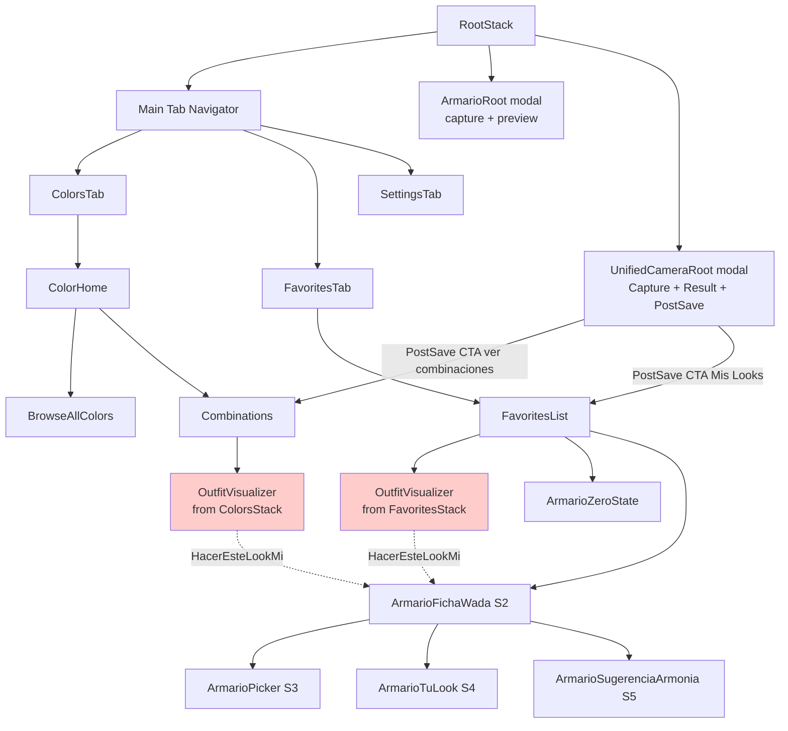
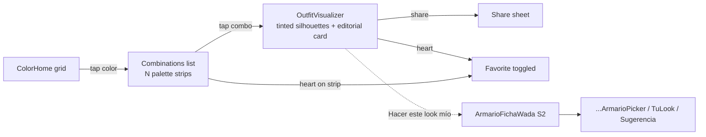
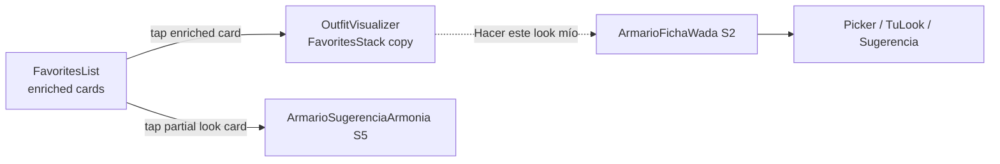
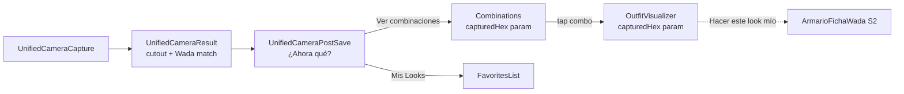
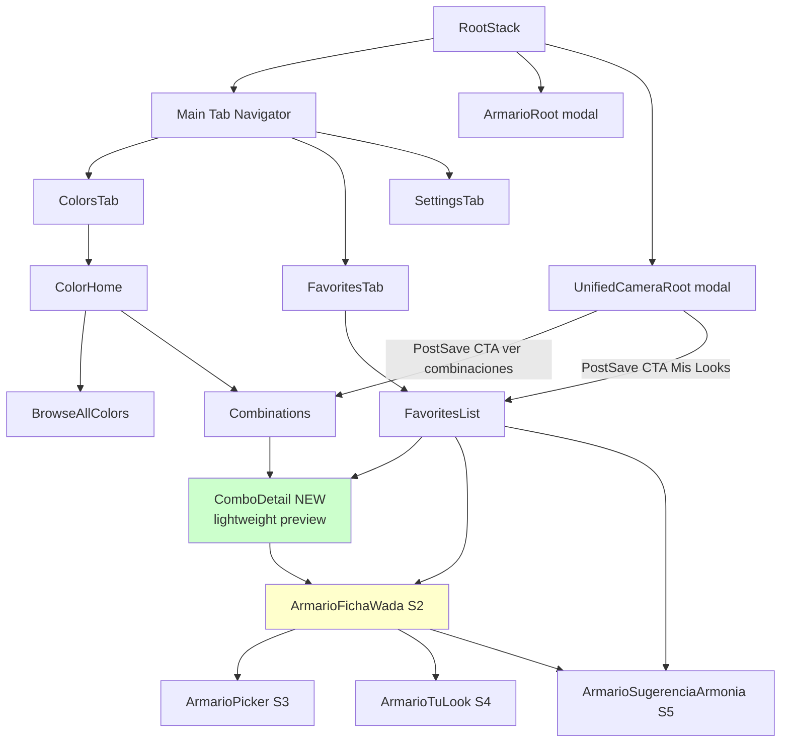
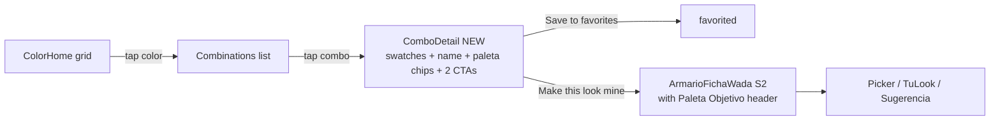
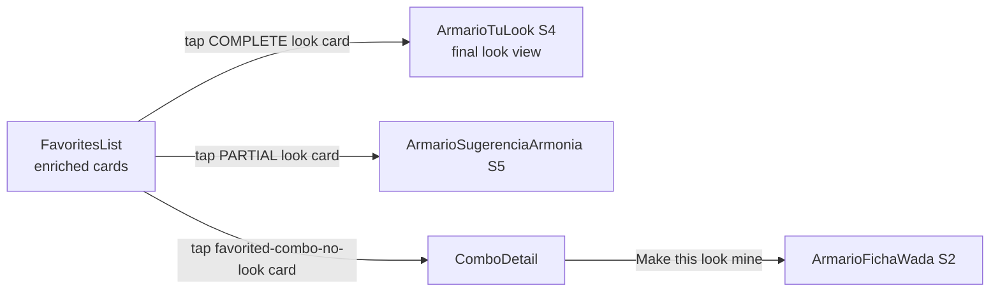
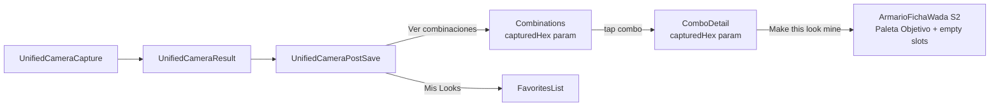

# UX Design Spec — v1.4.0 Visualizer Rework

> **TL;DR**: Kill the OutfitVisualizer screen (abstract tinted silhouettes). Unify the destination from every combo tap (Wada exploration, Favorites, post-camera) into ArmarioFichaWada (S2) — the Armario Virtual real-wardrobe flow. Introduce "Paleta Objetivo" as a lightweight header treatment of the existing slot system. Accept a known iOS 16 gap (see §7) that needs an explicit fallback decision before ship.

---

## 1. Why this rework exists

### 1.1 The tension Alejandro named

> *"Me sigue sobrando el Visualizer, me gusta y no a la vez, no termino de verlo ahora con todo lo que le hemos metido."*

That instinct is correct. The Visualizer is not broken — it is **out of tone** with what Outfinder became after Epic 13 (real-photo cutouts via Vision) and Epic 14 (Armario Virtual + incomplete looks + categorization). The app has **two models of visualization running in parallel**:

| Model | Origin | Input | Output |
|-------|--------|-------|--------|
| **Visualizer** (Epic 2) | Abstract Wada inspiration | Combination ID | Tinted silhouettes over Skia canvas, editorial card |
| **Armario Virtual** (Epic 13/14) | Real wardrobe assembly | Combination ID + user garments | Polaroid cascade of real photos of user's clothes |

Two visual languages fighting for the same screen real-estate. Users experience the seam as a "pegote" — the app looks premium when showing real garments and toy-like when showing tinted silhouettes.

### 1.2 Bugs this rework dissolves by design

From `epic-14-post-release-bugs.md`:

- **BUG-006** — Flash of Mis Looks before picker from Visualizer CTA. Dies by elimination — no Visualizer, no CTA, no flash.
- **BUG-010** — Visualizer renders garment as wrong category because it maps color-index-in-combo → anatomical slot. Dies by elimination — in ArmarioFichaWada, slots are defined by wardrobe-item category, not combo position.
- **BUG-009** (partially) — Auto-fill from post-camera save. NOT fully resolved in v1.4.0 (deferred to v2.0), but with Visualizer gone, at least the user lands on a screen where slots ARE defined by category, so the mental model no longer breaks.

### 1.3 What this rework does NOT do

- Does NOT add Botón Mágico, weather push, colorimetry, or any v2 magic feature.
- Does NOT introduce new Pencil UI components — reuses existing Armario S2-S5.
- Does NOT change the Camera flow itself (Epic 12/14 pipeline stays intact).
- Does NOT redesign Favorites list (BUG-005 stays deferred).

### 1.4 Success criteria

This rework succeeds if, after ship:

1. A first-time user entering via Wada exploration (Colors tab → pick color → combo) sees the same visual language as a user entering via Favorites — **no more "two apps in one"**.
2. A user taking a photo of a real garment and tapping "see combinations" arrives at a destination where their garment's category is respected (not shown in the wrong slot).
3. No user perceives a regression vs. v1.3.0 in what they can do (they can still browse combos, save favorites, build looks).
4. The screenshots/ASO assets produced for v1.4.0 are **80%+ reusable for v2.0**.

---

## 2. Scope boundary

### 2.1 In scope for v1.4.0

- Remove OutfitVisualizer screen from both `ColorsStack` and `FavoritesStack`.
- Re-route all combo-tap entry points to a unified destination.
- Introduce "Paleta Objetivo" as a visual treatment of the existing slot system.
- Add a lightweight "combo detail preview" for browse-without-commit (see §5 D1).
- Define persistence rule: when does a look become an "En curso" entry? (see §5 D2).
- Update i18n keys + strings touched.
- Update testIDs + remove obsolete tests.

### 2.2 Out of scope (deferred to v2.0)

- Botón Mágico (auto-complete look).
- Weather-driven morning suggestions.
- Colorimetry / seasonal palette filter.
- Complementos as first-class category (BUG-011).
- Post-camera garment auto-fill (BUG-009 complete resolution).

### 2.3 Open blockers (decide before ship)

- **iOS 16 fallback** (see §7 gap analysis). Either keep Visualizer behind a capability flag, raise deployment target to iOS 17, or accept swatch-only browse on iOS 16.

---

## 3. Current state flows (baseline)

All flows that currently touch `OutfitVisualizer`, as-is on branch `epic-14`.

### 3.1 Navigation topology



*Red nodes = Visualizer (to be deleted).*

### 3.2 Flow A: Wada exploration (no garment anchor)



**Pain points today:**
- Two ways to favorite (strip heart + Visualizer heart). Minor.
- Visualizer is a full screen for what is essentially "here are 3 silhouettes tinted". Heavy for the payoff.
- "Hacer este look mío" is the ONLY path to real-wardrobe mode from Wada exploration — users don't discover it unless they tap through.

### 3.3 Flow B: Favorites → look



**Pain points today:**
- Same Visualizer dead-end. User lands on tinted silhouettes when their mental model is "my saved look".
- Two destinations from FavoritesList (Visualizer vs S5) depending on completeness state. Inconsistent.

### 3.4 Flow C: Post-camera save



**Pain points today:**
- BUG-010 happens here: if the user's garment color lands in slot 2 or 3 of the combo, Visualizer renders it as bottom or shoes.
- BUG-009 happens here: when user hits "Hacer este look mío", the auto-fill is missing.
- BUG-006 happens here: flash of Mis Looks before ArmarioFichaWada opens.

---

## 4. Proposed flows (v1.4.0)

### 4.1 Navigation topology (proposed)



*Green = new. Yellow = now a unified hub destination.*

### 4.2 Flow A: Wada exploration (proposed)



**What changed:**
- Visualizer → ComboDetail (lightweight, no silhouettes).
- ComboDetail preserves browse-without-commit: no look is persisted until user taps "Make this look mine".
- Entry into Armario flow is explicit and intentional.

### 4.3 Flow B: Favorites → look (proposed)



**What changed:**
- No Visualizer entry from Favorites.
- Three entry destinations mapped to card state (complete look / partial look / combo favorited but no look yet) — consistent mental model.

### 4.4 Flow C: Post-camera save (proposed)



**What changed:**
- Visualizer eliminated from this path.
- User lands on ArmarioFichaWada where slots are defined by category — BUG-010 dies by construction.
- BUG-009 (auto-fill) remains open: in v1.4.0 the user still manually assigns their just-saved garment to the top slot from the Picker. v2.0 will auto-prefill.

---

## 5. Open UX decisions resolved

### 5.1 D1 — What replaces OutfitVisualizer as "combo preview"?

**Options considered:**

| Option | Description | Verdict |
|--------|-------------|---------|
| A. Kill entirely, jump from Combinations list straight to ArmarioFichaWada | Simpler nav, one less screen | ❌ Violates browse-without-commit; every casual tap persists a look |
| B. Lightweight **ComboDetail** screen — swatches + names + CTAs | Preserves browse-without-commit, no silhouettes | ✅ **Selected** |
| C. Modal preview (bottom sheet) from Combinations list | Saves a screen, feels native | ⚠️ Works but doesn't support share/deep-link; defer to v2 if needed |
| D. Inline expansion in Combinations list | No new screen, no navigation | ❌ Breaks Wada header (combo name deserves top-level space) |

**Decision: Option B — dedicated `ComboDetail` screen.**

**Rationale:**
- Preserves the existing mental model of "tap to see combo detail", users don't have to relearn.
- No silhouettes = visual consistency with Armario.
- Reuses existing components: ColorHeader (Wada name + combo name), color swatch strip, FavoriteButton, CTA button.
- Cheap to build: ~1 screen, ~100 LOC, mostly composition of existing components.

**Component composition of ComboDetail:**
- `WadaHeader` at top (combo Japanese + English name + Wada metadata).
- Large horizontal strip of color swatches (2–4 colors, full-width, tall ~120pt).
- For each swatch: hex + color name below (from `colorIndex`).
- `FavoriteButton` positioned over the swatch strip (top-right).
- **Paleta Objetivo mini-preview** (see §5.3): 3 small chips with ✓ indicator if a user garment already matches that color by category + hex (Wardrobe query).
- Primary CTA: "Make this look mine" (takes user to `ArmarioFichaWada` with `combinationId`).
- Secondary CTA: "Explore similar combos" (optional, defer if time-constrained — navigates back to Combinations filtered by complementary color).
- `MiniPaletteStrip` below CTA block (Wada heritage attribution — subtle).

### 5.2 D2 — When does a look get persisted to "En curso"?

**Options considered:**

| Option | When persisted | Side effects |
|--------|---------------|--------------|
| A. On entry to ArmarioFichaWada | Any combo-tap creates a look | "En curso" fills with 50 looks from browsing |
| B. On first garment assignment to a slot | User commits intent by assigning | Lazy; clean list |
| C. On exit from ArmarioFichaWada with any state | Complex edge cases | ❌ Unclear exit |
| D. Explicit "Save look" button | User action required | Adds friction; not aligned with "En curso = unfinished" semantics |

**Decision: Option B — persist on first garment assignment.**

**Rationale:**
- Matches the semantic of "En curso" = user started this look, didn't finish.
- Browsing 10 combos without assigning anything leaves zero trace. Clean.
- Once user assigns even one garment, the look is worth remembering.
- Technically: `useMisLooksStore` upserts a look entry keyed by `combinationId` on first `assignGarmentToSlot` call.

**Edge case: user already has a completed look for this combinationId and enters again.**
- They land on **ArmarioTuLook** (S4) directly, not ArmarioFichaWada. This is already the current behavior per Epic 14 — FavoritesList routing handles this based on `completenessLevel`.
- If entering via ComboDetail → "Make this look mine" with an existing completed look, we route to S4 instead of S2. Needs an explicit check in the nav handler.

### 5.3 D3 — How is "Paleta Objetivo" materialized?

**Context:** Today, ArmarioFichaWada S2 shows a grid of 3 slots (one per color in the combo). Each slot is a PolaroidCard with a WadaColorDot header. This is functional but doesn't visually communicate "these 3 colors are your target palette".

**Options considered:**

| Option | Description | Verdict |
|--------|-------------|---------|
| A. Fila de chips arriba del S2 screen — 3 swatches en línea, ✓ en los asignados | Visual header, clear status | ✅ **Selected** |
| B. Glow/halo alrededor del PolaroidCard cuando hay prenda asignada | More subtle, less literal | ⚠️ Works for visual delight but hides status at a glance |
| C. Estado explícito "2/3 colores listos" en el header | Text-based, accessible | ⚠️ Redundant with BUG-003 decision (we removed headers like "2/3") |
| D. Combinación: chips arriba (A) + glow en polaroids (B) | Belt-and-suspenders | ⚠️ Over-engineered for v1.4 — defer B to v2 as delight layer |

**Decision: Option A — chip row above the S2 slot grid.**

**Component spec: `PaletaObjetivoChips`**

```
┌──────────────────────────────────────────────────────┐
│  [🟢✓]  [🔴 ]  [🟡 ]       Navy · Carmín · Mostaza   │
└──────────────────────────────────────────────────────┘
```

- Row of 2–4 chips, one per color in the combo.
- Chip = circular swatch (32pt diameter) with optional `✓` overlay when a user garment is assigned to that slot.
- To the right of the chips: color names in a truncated label (respecting i18n — use Wada Spanish/English, not raw hex).
- Chip tap = scroll/focus to the corresponding slot below (nice-to-have, defer if tight).
- Reuses `WadaColorDot` as the chip base (already exists).

**Visual language:**
- Unassigned chip: swatch with subtle grayscale overlay (~70% desaturation) + thin dashed outline.
- Assigned chip: full saturation + green `✓` badge overlay (SF Symbol `checkmark.circle.fill` — 14pt, positioned top-right of chip).
- Respect reduce-motion: no pulse animations when chip state changes.

**A11y:**
- Row wrapper: `accessibilityLabel="Target palette: 2 of 3 colors assigned"`.
- Each chip: `accessibilityLabel="Navy, assigned"` / `"Carmín, not yet assigned"`.
- `accessibilityRole="image"` on each chip, or `"button"` if chip-tap is implemented.

---

## 6. Low-fi mockups (ASCII)

### 6.1 `ComboDetail` screen (NEW)

```
┌─────────────────────────────────────────────────────────┐
│  ‹ Back                                              ♡  │  ← header with back + favorite
│                                                         │
│              Kachi-iro · Carmín · Unmo                  │  ← WadaHeader JP name
│              Victory Color · Scarlet · Mica             │  ← WadaHeader EN name
│              3 colors · Sanzo Wada                      │  ← metadata subtitle
│                                                         │
│  ┌─────────────┬─────────────┬─────────────┐            │
│  │             │             │             │            │
│  │   #0A1940   │   #DC143C   │   #F5F0E8   │            │  ← large swatches
│  │             │             │             │            │
│  ├─────────────┼─────────────┼─────────────┤            │
│  │    Navy     │    Carmín   │     Unmo    │            │  ← color names
│  └─────────────┴─────────────┴─────────────┘            │
│                                                         │
│  Your target palette                                    │
│  ┌────┬────┬────┐                                       │
│  │ ⚫ │ 🔴 │ ⚪ │       Navy · Carmín · Unmo            │  ← Paleta chips
│  │ ✓ │    │    │                                       │  ← ✓ if user has garment
│  └────┴────┴────┘                                       │    matching that color
│                                                         │
│  ┌───────────────────────────────────────────────┐      │
│  │          Make this look mine                  │      │  ← primary CTA (black)
│  └───────────────────────────────────────────────┘      │
│                                                         │
│  ─ ─ ─ ─ ─ ─ ─ ─ ─ ─ ─ ─ ─ ─ ─ ─ ─ ─ ─ ─ ─ ─         │
│  Inspired by Sanzo Wada (1933)                          │  ← heritage attribution
└─────────────────────────────────────────────────────────┘
```

### 6.2 `ArmarioFichaWada` S2 WITH Paleta Objetivo header

```
┌─────────────────────────────────────────────────────────┐
│  ‹ Back              Kachi-iro                       ⋯  │  ← header (no counter per BUG-003)
│                                                         │
│  Your target palette                                    │
│  ┌────┬────┬────┐                                       │
│  │ ⚫ │ 🔴 │ ⚪ │       Navy · Carmín · Unmo            │  ← NEW chips row
│  │ ✓ │    │    │                                       │
│  └────┴────┴────┘                                       │
│                                                         │
│  ┌─────────────────────────────────────────────────┐    │
│  │                                                 │    │
│  │     ┌────────┐                                  │    │
│  │     │ [photo]│     Polaroid for Navy (assigned) │    │  ← PolaroidCard
│  │     │ T-shirt│                                  │    │    (existing component)
│  │     └────────┘                                  │    │
│  │                                                 │    │
│  │     ┌ ─ ─ ─ ┐                                   │    │
│  │     │   +   │     Polaroid for Carmín (empty)  │    │
│  │     │  add  │                                   │    │
│  │     └ ─ ─ ─ ┘                                   │    │
│  │                                                 │    │
│  │     ┌ ─ ─ ─ ┐                                   │    │
│  │     │   +   │     Polaroid for Unmo (empty)    │    │
│  │     │  add  │                                   │    │
│  │     └ ─ ─ ─ ┘                                   │    │
│  │                                                 │    │
│  └─────────────────────────────────────────────────┘    │
│                                                         │
└─────────────────────────────────────────────────────────┘
```

### 6.3 Current `OutfitVisualizer` — for reference, this goes away

```
┌─────────────────────────────────────────────────────────┐
│  ‹ Back            Kachi-iro                         ⋯  │
│                                                         │
│              [warm gradient background]                 │
│                                                         │
│              ┌──────────────────────┐                   │
│              │                      │                   │
│              │    [aureola glow]    │                   │
│              │                      │                   │
│              │    [tinted tshirt]   │   ← Skia ColorMatrix
│              │    [tinted pants ]   │     tinting on
│              │    [tinted shoes ]   │     placeholder PNGs
│              │                      │                   │
│              │   editorial card     │                   │
│              └──────────────────────┘                   │
│                                                         │
│              ▪ ▪ ▪    Navy · Carmín · Unmo              │
│                                                         │
│              Outfinder                                  │
│                                                         │
│        [ Hacer este look mío ]                          │
└─────────────────────────────────────────────────────────┘
```

**Note:** the visual language of the Visualizer (warm gradient, aureola, tinted silhouettes) does NOT migrate to ComboDetail. Those elements were tied to the abstract-silhouette paradigm — they don't fit the real-wardrobe paradigm.

---

## 7. Gap analysis — what diagramming surfaced

### 7.1 🔴 CRITICAL: iOS 16 users left without visualization

**Discovered:** `src/lib/platform.ts` gates Armario Virtual behind iOS 17. Deployment target is iOS 16.0 (`app.json`). So iOS 16 users today have the Visualizer as the ONLY way to visualize a combo. If we kill Visualizer without a fallback, iOS 16 users get:
- Combo list → ComboDetail (swatches only) → "Make this look mine" → iOS 17 gate blocks Armario flow.

**Options:**

| Option | Description | Trade-off |
|--------|-------------|-----------|
| i. Keep Visualizer code as iOS-16 fallback, route conditionally | Zero regression for iOS 16 | Dual code paths, Visualizer tests stay, complexity |
| ii. Raise deployment target to iOS 17 | Clean code, single model | Loses iOS 16 users (unknown %) |
| iii. Accept swatch-only browse on iOS 16 | Simplest | iOS 16 users get "Make this look" CTA that fails / is hidden |

**My recommendation (Sally):** Option **i** for v1.4.0 — keep the Visualizer code alive behind `isIOS17OrNewer()` check, render it instead of ComboDetail on iOS 16 devices. Remove entirely in v2.0 when iOS 17 deployment target is feasible. This is a one-conditional decision in the navigation handler, not a major complexity cost.

**Decision needed from Alejandro before implementation.** Flag this in dev handoff.

### 7.2 🟡 Medium: favoriting from ComboDetail vs. from PaletteStrip duplication

`PaletteStrip` in `Combinations` list has an inline `FavoriteButton`. `ComboDetail` also has one in its top-right. Same combination, two toggles. Not a bug but a micro-redundancy — users can favorite from the list without entering ComboDetail.

**Resolution:** accept. It's a known pattern (Instagram, Pinterest all allow favorite-before-detail). Keep both, both write to the same `FavoritesContext`.

### 7.3 🟡 Medium: "Hacer este look mío" semantics when user has other garments matching

Today, when the user enters ArmarioFichaWada via ComboDetail "Make this look mine", we don't auto-fill any garment. But if the user HAS a garment in their wardrobe whose color matches one of the combo slots (by Wada color ID), there's an implicit expectation that it could pre-select.

**v1.4.0 decision:** NO auto-fill. User opens Picker from the slot and sees their matching garment highlighted as "suggestion" (the Picker already does this per Epic 14). v2.0's Botón Mágico resolves full auto-fill.

### 7.4 🟡 Medium: entry into ArmarioFichaWada for a look that is ALREADY completed

**Today:** FavoritesList routes completed looks to ArmarioTuLook (S4), partial looks to ArmarioSugerenciaArmonia (S5), and combos-without-look to Visualizer. After rework, combo tap → ComboDetail → "Make this look mine" should intelligently route:
- If a look with `combinationId` exists and is complete → ArmarioTuLook (S4).
- If a look exists and is partial → ArmarioSugerenciaArmonia (S5) OR ArmarioFichaWada (S2) depending on intent.
- If no look exists → ArmarioFichaWada (S2).

**Spec:** the nav handler on "Make this look mine" reads `useMisLooksStore.getLookByCombinationId(id)` and branches:
- `!look` → S2.
- `look.completenessLevel === "complete"` → S4.
- `look.completenessLevel === "partial"` → S2 (let the user continue editing; S5 is reached only from FavoritesList's sugerencia card).

### 7.5 🟢 Low: Post-camera PostSave CTA "Ver combinaciones" routing

Today, `UnifiedCameraPostSaveScreen` CTA `"Ver combinaciones con {{wadaName}}"` navigates to `Combinations` on `ColorsTab`. After rework this still works (Combinations → ComboDetail → ArmarioFichaWada). No change needed to PostSave.

### 7.6 🟢 Low: Share affordance loss

Today the OutfitVisualizer has a built-in Share button (captures the editorial card as an image). **After rework, nothing in ComboDetail → ArmarioFichaWada flow explicitly offers share.**

**ArmarioTuLook (S4) already has share** — the polaroid cascade export (1080×1920 JPEG). So share from completed looks is preserved.

**What's lost:** share-a-combo-as-inspiration (not yet a look, just a Wada combo). 

**Options:**
- i. Accept loss. Users can save favorite + share from the completed look later.
- ii. Add simple share affordance to ComboDetail (export the swatches + Wada name as an image card). Low effort.

**Recommendation:** Option i for v1.4.0. Don't build share-the-inspiration unless users request it. Validate with the 50 TestFlight users.

### 7.7 🟢 Low: Deep-link testing / navigation state persistence

React Navigation restores state on app reopen. If a user backgrounds the app while on Visualizer, reopens — today they land on Visualizer. After rework, need to make sure stale Visualizer navigation state doesn't crash.

**Resolution:** when removing Visualizer from stack params, clear any persisted state that references `"OutfitVisualizer"` on app upgrade. One-time state migration in `App.tsx`.

### 7.8 🟢 Low: i18n keys that become orphaned

Any strings used only by OutfitVisualizer get orphaned. Biome doesn't catch unused i18n keys. Need a cleanup pass, ideally with `pnpm test -- i18n.test` still passing (the test validates parity EN↔ES, not usage).

**Resolution:** grep for `t("outfit`, `t("visualizer`, etc., remove from both `en.json` and `es.json`. Keep parity intact.

### 7.9 🟢 Low: Existing users' saved state

Users who already have saved looks (and v1.3.0 "favorites" that are just combinationIds) — nothing breaks. FavoritesList already handles the completeness-partition sort (Epic 14). No data migration required.

---

## 8. Dev handoff — concrete change list

### 8.1 Files to DELETE

- `src/screens/OutfitVisualizer.tsx`
- `src/screens/OutfitVisualizer.test.tsx` (and any snapshot files)
- Any test fixtures exclusive to Visualizer (check `__tests__/` folders)

**Guard:** if §7.1 Option i is chosen (iOS 16 fallback), do NOT delete — conditionally render instead.

### 8.2 Files to MODIFY

| File | Change |
|------|--------|
| `src/navigation/types.ts` | Remove `OutfitVisualizer` from `ColorsStackParamList` + `FavoritesStackParamList`. Add `ComboDetail: { combinationId: string; capturedHex?: string }` to both stacks (or to a shared stack — evaluate). |
| `src/navigation/ColorsStack.tsx` | Replace `OutfitVisualizer` registration with `ComboDetail`. |
| `src/navigation/FavoritesStack.tsx` | Replace `OutfitVisualizer` registration with `ComboDetail`. |
| `src/screens/Combinations.tsx` | Change `onPress` handler of each palette strip: `push("ComboDetail", ...)` instead of `push("OutfitVisualizer", ...)`. |
| `src/screens/FavoritesList.tsx` | Router logic: tap on a favorited-combo-no-look card → `push("ComboDetail", ...)`. Complete looks still route to S4, partial to S5. |
| `src/screens/unifiedCamera/UnifiedCameraPostSaveScreen.tsx` | No change needed — PostSave already routes to Combinations, which flows into ComboDetail. Verify. |
| `src/screens/armario/ArmarioFichaWadaScreen.tsx` | Add `PaletaObjetivoChips` component above the slot grid. Update layout. |
| `src/i18n/locales/en.json` + `es.json` | Remove orphaned keys. Add new keys for ComboDetail + PaletaObjetivoChips copy. |

### 8.3 Files to CREATE

| File | Purpose |
|------|---------|
| `src/screens/ComboDetail.tsx` | New screen per §5.1 spec |
| `src/screens/ComboDetail.test.tsx` | Tests: renders header, renders swatch row, favorite toggle, CTA navigates |
| `src/components/PaletaObjetivoChips.tsx` | New component per §5.3 spec |
| `src/components/PaletaObjetivoChips.test.tsx` | Tests: renders chips, shows ✓ on assigned, a11y labels |

### 8.4 i18n new keys (EN + ES)

```json
{
  "comboDetail": {
    "yourTargetPalette": "Your target palette",
    "makeThisLookMine": "Make this look mine",
    "heritageAttribution": "Inspired by Sanzo Wada (1933)"
  },
  "paletaObjetivo": {
    "label_some": "Target palette: {{done}} of {{total}} colors assigned",
    "label_none": "Target palette: {{total}} colors to assign",
    "chip_assigned": "{{colorName}}, assigned",
    "chip_unassigned": "{{colorName}}, not yet assigned"
  }
}
```

### 8.5 testIDs convention

- ComboDetail screen: `testID="combo-detail-screen"`
- Swatch strip: `testID="combo-detail-swatch-{index}"`
- Make this look mine CTA: `testID="combo-detail-cta-make-look"`
- Paleta Objetivo chips row: `testID="paleta-objetivo-chips"`
- Individual chip: `testID="paleta-objetivo-chip-{colorId}"`

### 8.6 Navigation migration guard

On app launch, if React Navigation's persisted state contains `OutfitVisualizer` route name, discard the persisted state (let app start from Tab home). One-shot, additive to existing `App.tsx` init.

### 8.7 Tests to ADD

- `ComboDetail` renders header + swatches + CTA.
- `ComboDetail` CTA navigates to `ArmarioFichaWada` with correct params.
- `ComboDetail` CTA navigates to `ArmarioTuLook` when look is already complete.
- `PaletaObjetivoChips` renders N chips based on combo, shows ✓ correctly.
- `ArmarioFichaWada` renders `PaletaObjetivoChips` with correct assignment state.
- Navigation migration: app launch with stale Visualizer state doesn't crash.

### 8.8 Tests to REMOVE

- All `OutfitVisualizer.test.tsx` test cases (if Visualizer deleted).
- Any Combinations test that asserts navigation to Visualizer — update to assert ComboDetail.
- Any FavoritesList test that asserts navigation to Visualizer — update.

### 8.9 Estimated effort (asistente — take with skepticism)

Rough breakdown, not committed:
- ComboDetail screen: 4–6h (composition of existing components, tests).
- PaletaObjetivoChips component: 2–3h (including tests + a11y).
- Navigation wiring: 2–3h (stack changes, param types, guard).
- i18n cleanup + new keys: 1h.
- ArmarioFichaWada S2 integration of chips: 1–2h.
- Migration guard + test: 1h.
- iOS 16 fallback (if chosen): +3–4h.
- **Total: 14–20h** (~2–3 dev days).

---

## 9. Handoff checklist (pre-implementation)

Before dev agent takes this doc:

- [ ] **Alejandro decides §7.1** (iOS 16 fallback): Option i, ii, or iii.
- [ ] Alejandro confirms §5.1 ComboDetail layout or requests Pencil mockup.
- [ ] Alejandro confirms §5.3 PaletaObjetivoChips visual style.
- [ ] Alejandro decides §7.6 (share affordance in ComboDetail): yes or no.
- [ ] Spec is frozen — no more additions beyond this point unless caught in code review.

---

## 10. Out-of-doc dependencies

- `v2-strategy-brief.md` §Bloque 1 — this rework is a consistent *subset* of v2.0, not a contradiction. If v2.0 is scoped, ComboDetail may get Botón Mágico added in place of "Make this look mine" OR alongside it.
- `epic-14-post-release-bugs.md` — BUG-009, BUG-010, BUG-011 stay OPEN in the bug log but mark them "superseded by v1.4 rework" (BUG-010 closed by elimination, BUG-009 partial, BUG-011 deferred to v2 complementos).

---

*End of spec. Sally signing off — next move is Alejandro's review + decisions on §9 checklist.*
